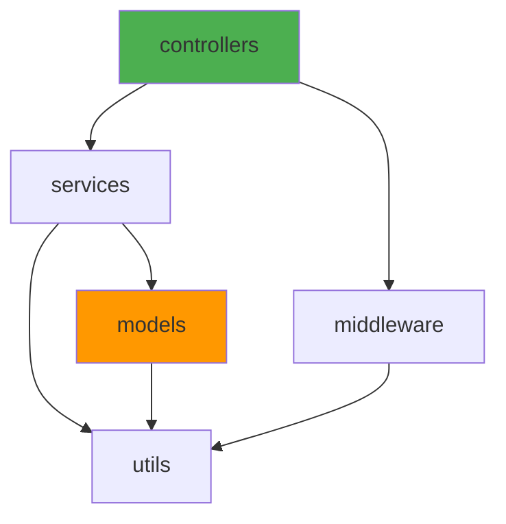

# Skill: Dependency Graph

Analyze module import relationships to detect circular dependencies, identify coupling hotspots, and visualize the dependency structure.

## Trigger
When the user asks to analyze dependencies, find circular imports, map module relationships, or reduce coupling.

## Prerequisites
- [ ] Source directory identified
- [ ] Language/module system known (ESM, CommonJS, Python imports)

## Steps

### Step 1: Scan Imports
- [ ] Parse all source files for import/require statements
- [ ] Build adjacency list: `module A → [module B, module C, ...]`
- [ ] Categorize imports:

| Category | Examples |
|----------|---------|
| **External** | `express`, `lodash`, `zod` |
| **Internal package** | `@myorg/shared`, `@myorg/utils` |
| **Relative** | `./service`, `../models/user` |
| **Type-only** | `import type { X }` (TypeScript) |

### Step 2: Detect Circular Dependencies
- [ ] Run DFS (depth-first search) on the dependency graph
- [ ] Report all cycles found with the full chain:
```
CIRCULAR: A → B → C → A
CIRCULAR: X → Y → X
```
- [ ] Classify severity:
  - **Runtime circular** (actual `import`/`require`) — must fix
  - **Type-only circular** (`import type`) — usually safe

### Step 3: Calculate Metrics

| Metric | Formula | Healthy Threshold |
|--------|---------|-------------------|
| **Fan-out** | Number of modules this module imports | < 10 |
| **Fan-in** | Number of modules that import this module | High = shared utility |
| **Instability** | Fan-out / (Fan-in + Fan-out) | 0 = stable, 1 = unstable |
| **Depth** | Longest import chain from entry point | < 8 |

### Step 4: Identify Hotspots
- [ ] **God modules:** Fan-in > 20 (too many things depend on it)
- [ ] **Spaghetti modules:** Fan-out > 15 (imports too many things)
- [ ] **Unstable shared modules:** High fan-in AND high instability
- [ ] **Deep chains:** Import depth > 8 levels

### Step 5: Generate Visualization

#### Mermaid Diagram


#### Text Summary
```
Module Dependency Report
========================
Total modules: 45
External dependencies: 23
Circular dependencies: 2
Max depth: 6

Top Fan-In (most imported):
  1. src/utils/logger.ts       (imported by 28 modules)
  2. src/types/common.ts       (imported by 22 modules)
  3. src/config/index.ts       (imported by 18 modules)

Top Fan-Out (most imports):
  1. src/handlers/order/create/handler.ts  (imports 12 modules)
  2. src/services/order.service.ts         (imports 10 modules)

Circular Dependencies:
  ⚠ src/services/user.ts → src/services/order.ts → src/services/user.ts
  ⚠ src/models/product.ts → src/utils/pricing.ts → src/models/product.ts
```

### Step 6: Suggest Improvements
- [ ] For circular deps: suggest dependency inversion, event-based communication, or extracting shared module
- [ ] For god modules: suggest splitting into focused modules
- [ ] For deep chains: suggest flattening with direct imports
- [ ] For high coupling: suggest introducing interfaces or facade patterns

### Step 7: Validate Boundaries
- [ ] Check that dependency direction follows architecture rules:
  - Controllers → Services → Models (not reverse)
  - No direct database access from controllers
  - Shared types only from `common/` or `types/`

## Rules
- **ALWAYS** distinguish runtime imports from type-only imports
- **ALWAYS** report circular dependencies with full cycle path
- **ALWAYS** include actionable suggestions, not just problems
- Exclude `node_modules`, `dist`, `coverage`, and test files from analysis
- Group results by directory/module for readability
- Use Mermaid diagrams for visual output when helpful

## Completion
Dependency report with metrics, circular dependency detection, hotspot analysis, and improvement suggestions.

## If a Step Fails
- **Too many modules (>200):** Analyze at directory level first, drill into hotspots
- **Dynamic imports:** Flag `import()` calls as "dynamic — not fully trackable"
- **Re-exports:** Follow re-export chains to find actual source
- **Monorepo:** Analyze per-package first, then cross-package dependencies
