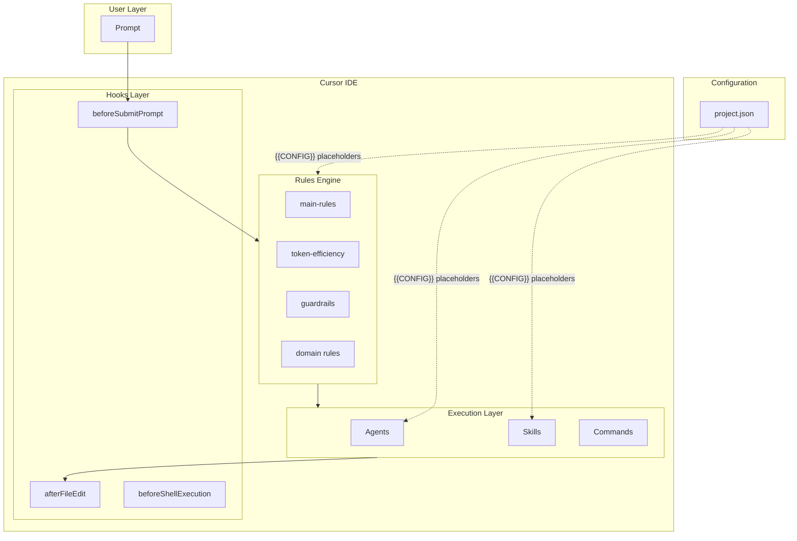
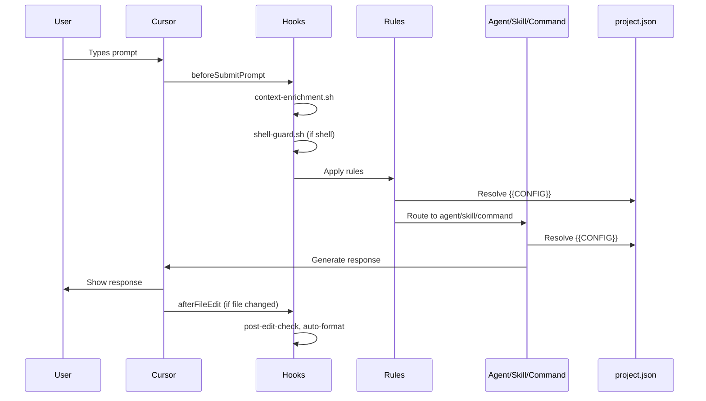

# cursor-handbook Architecture

This document describes the architecture of cursor-handbook — how its components interact, how configuration flows, and how the system extends.

---

## High-Level Architecture



cursor-handbook is an **open-source rules engine** for Cursor IDE. It does not run as a separate service — it augments Cursor's built-in AI with project-specific rules, agents, skills, commands, and hooks.

---

## Component Layers

### Layer 1: Hooks (Event-Driven)

Hooks run at specific points in the Cursor agent loop. They are shell scripts invoked by Cursor.

| Event | Purpose |
|-------|---------|
| `beforeSubmitPrompt` | Enrich context, inject project settings |
| `afterFileEdit` | Validate changes, auto-format, scan secrets |
| `beforeShellExecution` | Block dangerous commands, warn on expensive ops |

**Location**: `.cursor/hooks/`  
**Config**: `.cursor/hooks.json`  
**Constraint**: Scripts must be executable (`chmod +x`)

### Layer 2: Rules (Always Active)

Rules are markdown files with YAML frontmatter. Cursor loads them and applies their content to every AI interaction (or when `globs` match).

| Rule Type | `alwaysApply` | `globs` | When Applied |
|-----------|---------------|---------|--------------|
| Global | `true` | — | Every session |
| Domain | `false` | `**/*.ts`, etc. | When matching files in context |

**Location**: `.cursor/rules/`  
**Keywords**: `description`, `alwaysApply`, `globs`  
**Content**: Uses `{{CONFIG.section.key}}` placeholders resolved from `project.json`

### Layer 3: Agents, Skills, Commands (On Demand)

| Component | Trigger | Purpose |
|-----------|---------|---------|
| **Agents** | `/agent-name` or `@agent-name` | Specialized assistants for complex tasks |
| **Skills** | Context match or `/skill-name` | Step-by-step workflows with checklists |
| **Commands** | `/command` | Quick single actions (type-check, build, etc.) |

**Agents**: `.cursor/agents/` — **must be at root** (no subdirectories; Cursor does not discover nested agents)  
**Skills**: `.cursor/skills/<name>/SKILL.md` — supports `scripts/`, `references/`, `assets/`  
**Commands**: `.cursor/commands/` — one file per command

### Layer 4: Templates (Referenced)

Templates are code scaffolds referenced by skills and agents. They use `{{CONFIG}}` placeholders.

**Location**: `.cursor/templates/`

---

## Configuration Architecture

### project.json — Single Source of Truth

`project.json` is **cursor-handbook's convention** — not a Cursor-native feature. It centralizes:

- Project identity (`name`, `description`)
- Tech stack (`language`, `framework`, `database`)
- Paths (`handlerBasePath`, `commonPath`)
- Patterns (`handlerFlowSteps`, `handlerFlow`)
- Testing (`coverageMinimum`, `testCommand`)
- Database conventions (`softDeleteField`, `timestampFields`)

### How {{CONFIG}} Works

```
Prompt + Rule + project.json
```

1. **Prompt** — User types in Cursor chat
2. **Rule** — Loaded by Cursor; contains `{{CONFIG.techStack.language}}`, `{{CONFIG.paths.handlerBasePath}}`, etc.
3. **project.json** — Read by the AI when rules reference it; values fill the placeholders

Rules that mention `project.json` or use `{{CONFIG}}` cause the AI to load the config file and resolve placeholders. This gives one config file that drives all components.

### Schema Validation

`.cursor/config/project-schema.json` defines the JSON Schema. Editors provide autocomplete and validation.

---

## Data Flow



---

## Directory Structure

```
.cursor/
├── config/           # project.json, schema, templates
├── rules/            # .mdc files, organized by domain
├── agents/           # .md files at root only
├── skills/           # <name>/SKILL.md + scripts/, references/, assets/
├── commands/         # .md files
├── hooks.json        # Hook wiring (Cursor reads this at .cursor/hooks.json)
├── hooks/            # .sh hook scripts (paths referenced from hooks.json)
├── templates/        # Code scaffolds
├── settings/         # IDE settings, keybindings
└── BUGBOT.md         # BugBot PR review rules (separate from rules/)
```

### Key Constraints

| Constraint | Reason |
|------------|--------|
| Agents at root only | Cursor discovers agents only in `.cursor/agents/`; no subdirs |
| Hooks executable | `chmod +x` required for scripts |
| project.json required | Components use `{{CONFIG}}`; unresolved placeholders appear as literal text |

---

## Extension Points

### Adding a New Rule

1. Create `.cursor/rules/<domain>/<name>.mdc`
2. Add frontmatter: `description`, `alwaysApply`, `globs` (optional)
3. Use `{{CONFIG.section.key}}` for config-driven values

### Adding a New Agent

1. Create `.cursor/agents/<name>-agent.md` (at root)
2. Add frontmatter: `name`, `description`
3. Document invocation: `/agent-name` or `@agent-name`

### Adding a New Skill

1. Create `.cursor/skills/<name>/SKILL.md`
2. Add frontmatter: `name`, `description`
3. Optional: `scripts/`, `references/`, `assets/`

### Adding a New Command

1. Create `.cursor/commands/<category>/<name>.md`
2. Add frontmatter: `name`, `description`
3. Document action and when to use

### Adding a New Hook

1. Create `.cursor/hooks/<name>.sh` and make executable
2. Add entry to `.cursor/hooks.json` under the appropriate event

---

## Related Documentation

- [Configuration Guide](docs/getting-started/configuration.md) — project.json details
- [Cursor-Recognized Files](docs/reference/cursor-recognized-files.md) — Cursor keywords and file discovery
- [Component Overview](docs/components/overview.md) — How components work together
