<p align="center">
  
  
  
  
  
  
  
  
</p>

# cursor-handbook

**The open-source rules engine for Cursor IDE — 117 components (rules, agents, skills, commands, hooks) that turn your AI into a senior engineer who follows your standards, knows your codebase, and never wastes a token.**

> Stop teaching your AI the same things every session. cursor-handbook gives Cursor permanent memory of your standards, security policies, and workflows — across every project, every team member, every prompt.

<p align="center">
  <strong>If cursor-handbook helps you, consider giving it a ⭐ — it helps others discover it.</strong>
</p>

<p align="center">
  
</p>

---

## Table of Contents

- [Ways to use](#ways-to-use-cursor-handbook)
- [The Problem](#the-problem)
- [Before vs After](#before-vs-after)
- [Who is this for?](#who-is-this-for)
- [How It Works](#how-it-works)
- [Quick Start](#quick-start-5-minutes)
- [Documentation](#documentation)

---

## Ways to use cursor-handbook

Pick the option that fits your workflow:

| Option | Best for |
|--------|----------|
| **1. Clone & copy** | Use the full rules engine in your repo. Clone this repo, copy the `.cursor` folder into your project, then edit `project.json` and tailor rules/agents/skills to your stack. |
| **2. Add from GitHub (Cursor UI)** | Use rules, skills, or agents without cloning. In Cursor IDE go to **Settings → Rules / Skills / Agents**, click **Add new → Add from GitHub**, and paste this repo’s clone URL. Add only what you need. |

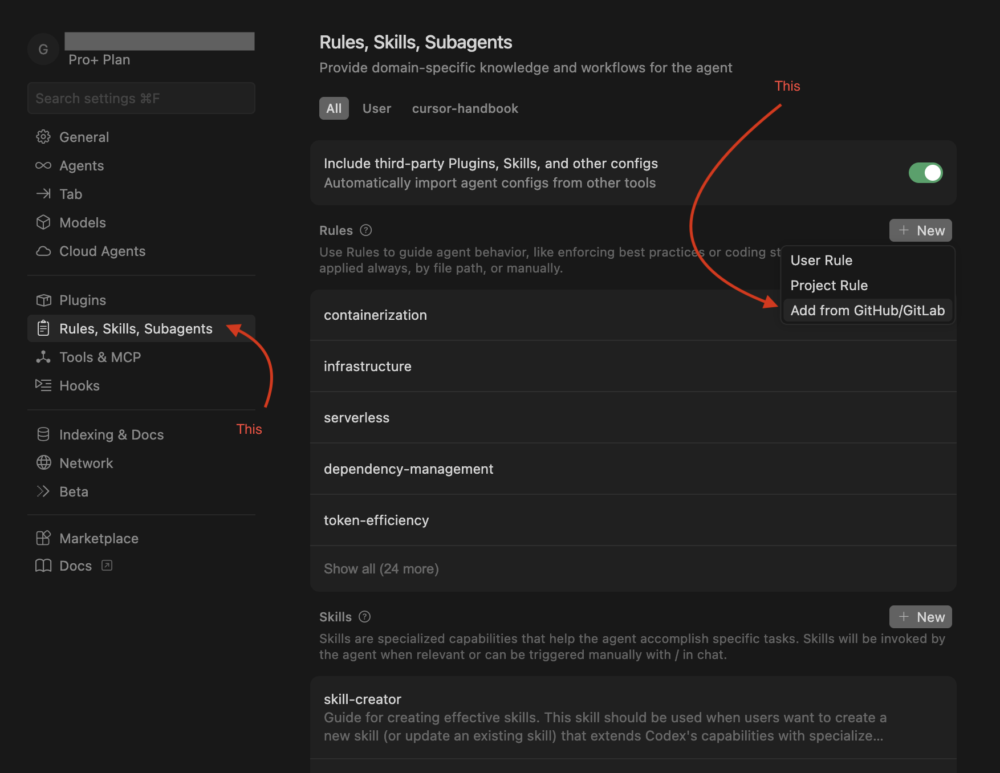
| **3. Fork & customize** | Maintain your own version. Fork this repo, adapt the `.cursor` files for your team or product, then use that fork across your projects or share it internally. |
| **4. Pick and choose** | Use individual components. Download only the production-ready, generic rules, skills, agents, commands, or hooks you need from this repo and drop them into your existing `.cursor` setup. |
| **5. Handbook website** | **Browse** components or read **Guidelines** (Cursor IDE topics) in the browser — **[GitHub Pages](https://girijashankarj.github.io/cursor-handbook/)** (optional; clone, ZIP, and command line still work). |

**Improvements welcome.** If you want to add or improve rules, skills, hooks, agents, or commands, see [CONTRIBUTING.md](CONTRIBUTING.md) and open an issue or PR.

> **Forking?** Replace `girijashankarj` with your GitHub org/username in badges, clone URLs, `scripts/setup-cursor.sh`, `.github/CODEOWNERS`, and docs before pushing.

---

## The Problem

Every time you open Cursor IDE, your AI assistant starts from zero. It doesn't know your:

- Code conventions and architecture patterns
- Security policies (and happily hardcodes your API keys)
- Testing thresholds (and runs the full 100K-token test suite when you just wanted a type check)
- Handler patterns, naming conventions, or folder structure

You end up repeating yourself, burning tokens, and fixing the same mistakes. **cursor-handbook fixes this permanently.**

---

## Before vs After

| Before cursor-handbook | After cursor-handbook |
|------------------------|------------------------|
| AI hardcodes API keys | Security rules block it |
| AI runs full test suite (~100K tokens) | Uses type-check (~10K) or single-file tests |
| You repeat conventions every session | Rules remember them — always on |
| Inconsistent code across team | One rules engine, one standard |
| No guardrails on expensive ops | Hooks warn or block dangerous commands |

<p align="center">
  
</p>

---

## Who is this for?

| Audience | Benefit |
|----------|---------|
| **Solo developers** | Consistent AI behavior without repeating yourself every session |
| **Teams** | Shared standards; everyone gets the same guardrails and conventions |
| **Enterprises** | Security, compliance, and token efficiency built in from day one |

<p align="center">
  
</p>

---

## How It Works

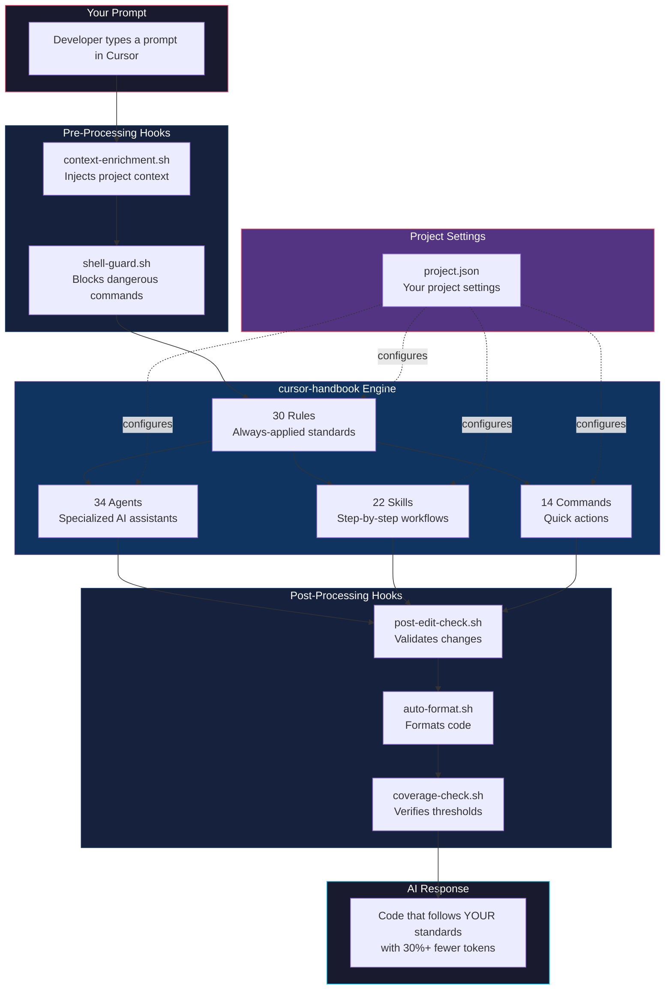

---

## What's Inside

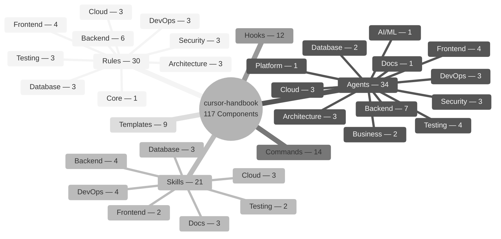

| Layer         | Count | What It Does                                      | How It's Triggered                  |
| ------------- | ----: | ------------------------------------------------- | ----------------------------------- |
| **Rules**     |    30 | Enforces coding standards on every AI interaction | Automatically — always on           |
| **Agents**    |    34 | Specialized assistants for complex tasks          | On demand — `/agent-name`           |
| **Skills**    |    22 | Step-by-step guided workflows with checklists     | Contextually — when patterns match  |
| **Commands**  |    14 | Lightweight, token-efficient quick actions        | On demand — `/command`              |
| **Hooks**     |    12 | Automation scripts in the AI loop                 | Event-driven — before/after actions |
| **Templates** |     9 | Scaffolding for handlers, components, tests, etc. | Referenced by skills and agents     |

> **Note:** The 117 component count = Rules + Agents + Skills + Commands + Hooks. Templates (9) are supporting assets referenced by skills and agents.

---

## Quick Start (5 minutes)

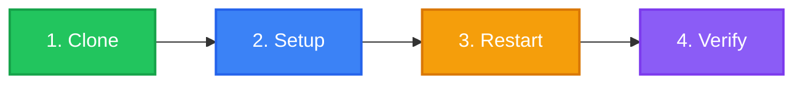

### One-line install

```bash
git clone https://github.com/girijashankarj/cursor-handbook.git .cursor && make -f .cursor/Makefile init
```

Then edit `.cursor/config/project.json` and restart Cursor.

### Step 1 — Clone

```bash
# Into your existing project
git clone https://github.com/girijashankarj/cursor-handbook.git .cursor
```

### Step 2 — Configure

```bash
# Option A: One-command setup
make init

# Option B: Interactive generator
./scripts/init-project-config.sh

# Option C: Manual copy
cp .cursor/config/project.json.template .cursor/config/project.json
```

Edit `.cursor/config/project.json` — replace placeholders with your project details:

```json
{
	"project": { "name": "my-api", "description": "Order management service" },
	"techStack": {
		"language": "TypeScript",
		"framework": "Express.js",
		"database": "PostgreSQL",
		"testing": "Jest",
		"packageManager": "pnpm"
	},
	"testing": {
		"coverageMinimum": 90,
		"testCommand": "pnpm run test",
		"typeCheckCommand": "pnpm run type-check"
	}
}
```

### Step 3 — Restart Cursor IDE

Close and reopen Cursor. All 117 components are now active.

### Step 4 — Verify

Try any of these:

```
/type-check          → Runs type checking (saves ~90K tokens vs full tests)
/code-reviewer       → AI reviews your code like a senior engineer
/generate-handler    → Scaffolds a complete API handler
```

### Alternative: One-Line Setup

```bash
curl -fsSL https://raw.githubusercontent.com/girijashankarj/cursor-handbook/main/scripts/setup-cursor.sh | bash
```

### Alternative: Git Submodule (for teams)

```bash
git submodule add https://github.com/girijashankarj/cursor-handbook.git .cursor
make init
# Or: cp .cursor/config/project.json.template .cursor/config/project.json
```

---

## User Flow

Here's what happens at every stage of your development workflow:

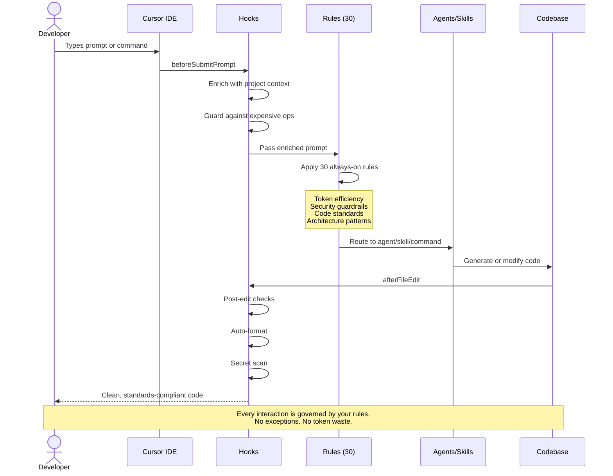

### Typical Workflows

| What You Want        | What You Type                    | What Happens                                                   |
| -------------------- | -------------------------------- | -------------------------------------------------------------- |
| Build a new endpoint | "Create a POST /orders endpoint" | Skill triggers full handler scaffolding (9 files, 7-step flow) |
| Review code          | `/code-reviewer`                 | Agent checks security, performance, correctness, tests         |
| Fix broken tests     | `/testing-agent fix these tests` | Skill diagnoses failures, fixes mocks, verifies coverage       |
| Quick validation     | `/type-check`                    | Runs type check (~10K tokens) instead of full tests (~100K)    |
| Deploy safely        | `/deployment-agent`              | Agent generates deployment checklist with rollback plan        |
| Optimize a query     | `/query-opt-agent`               | Agent runs EXPLAIN ANALYZE, rewrites query, adds indexes       |

---

## Processing Pipeline

Every prompt flows through a layered processing pipeline that ensures quality, security, and efficiency:

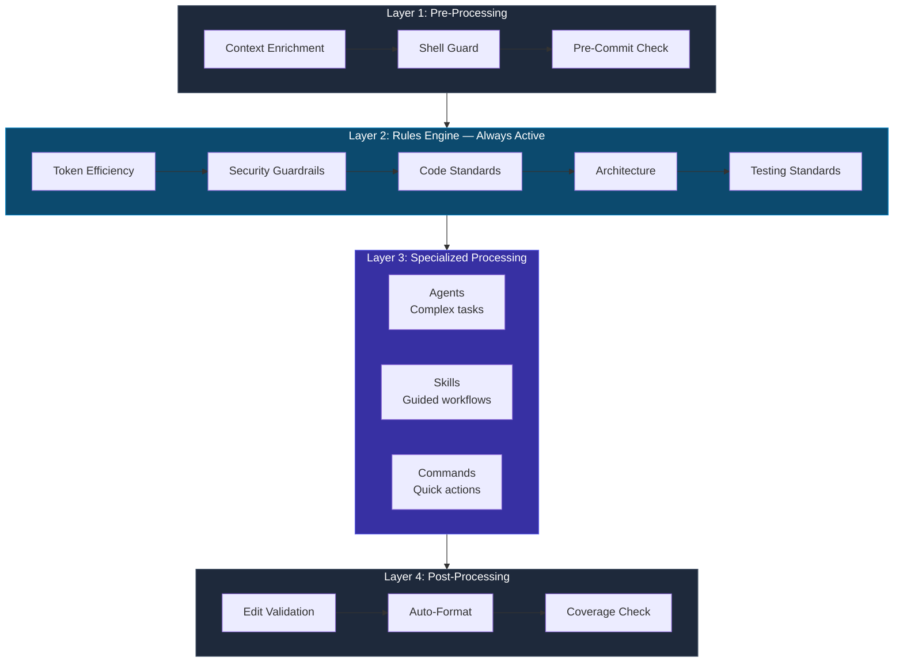

### Layer Breakdown

**Layer 1 — Pre-Processing (Hooks)**
Before your prompt even reaches the AI, hooks inject your project context, block dangerous shell commands, and validate git operations.

**Layer 2 — Rules Engine (30 Rules, Always Active)**
Every AI response is shaped by your rules. These aren't suggestions — they're hard constraints:

| Rule Category     | What It Enforces                                            |
| ----------------- | ----------------------------------------------------------- |
| Token Efficiency  | No auto-running full tests/lint; confirm 50K+ ops           |
| Security          | No hardcoded secrets; no PII in logs; parameterized queries |
| Architecture      | Handler pattern; dependency direction; error hierarchy      |
| Code Organization | Naming conventions; import order; folder structure          |
| Database          | Soft delete only; required columns; migration safety        |
| Testing           | 90%+ coverage; mock patterns; AAA pattern                   |

**Layer 3 — Specialized Processing**
Based on your prompt, the right component activates: an agent for complex tasks, a skill for guided workflows, or a command for quick operations.

**Layer 4 — Post-Processing (Hooks)**
After code is generated, hooks validate the output, auto-format files, scan for leaked secrets, and verify test coverage.

---

## Token Savings

cursor-handbook is engineered to cut your AI token costs by 30% or more:

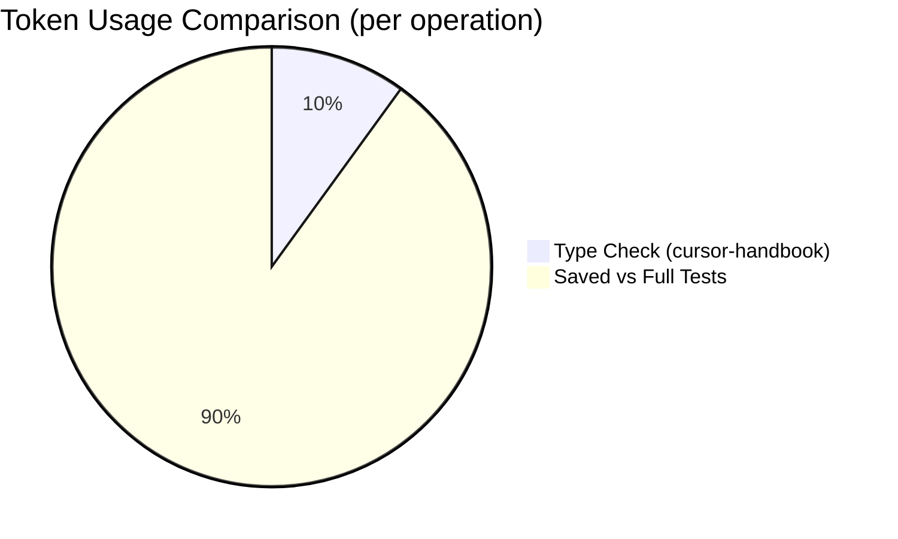

| Without cursor-handbook         | With cursor-handbook                    | Tokens Saved   |
| ------------------------------- | -------------------------------------- | -------------- |
| Full test suite: ~100K tokens   | `/type-check`: ~10K tokens             | **~90K (90%)** |
| Full lint run: ~50K tokens      | `/lint-check` (read_lints): ~2K tokens | **~48K (96%)** |
| Full test suite: ~100K tokens   | `/test-single`: ~5K tokens             | **~95K (95%)** |
| Unfiltered context: ~30K tokens | Context layering: ~10K tokens          | **~20K (67%)** |
| Verbose AI output: ~15K tokens  | Concise guidelines: ~5K tokens         | **~10K (67%)** |

**Conservative estimate**: A developer making 50 AI interactions/day saves **~200K tokens/day** — that's real money at scale.

---

## Customization

cursor-handbook is 100% project-driven. Every component adapts to your project through a single file:

### How It Adapts to Your Project

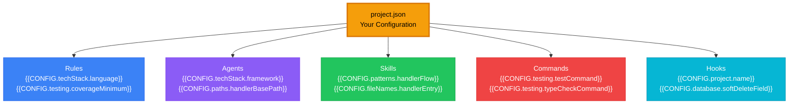

### What You Can Customize

| Section       | What It Controls           | Example                                        |
| ------------- | -------------------------- | ---------------------------------------------- |
| `project`     | Project identity           | Name, description, repo URL                    |
| `techStack`   | Language, framework, tools | TypeScript + Express or Python + FastAPI       |
| `paths`       | Directory structure        | Where handlers, services, and common code live |
| `domain`      | Business entities          | Order, Product, Customer + lifecycle states    |
| `patterns`    | Code patterns              | 7-step handler flow, error handling strategy   |
| `testing`     | Quality gates              | 90% coverage, test/lint/type-check commands    |
| `database`    | DB conventions             | Soft delete field, timestamp columns, naming   |
| `packages`    | Internal packages          | `@your-org` scope, registry URL                |
| `conventions` | Git and workflow           | Branch prefixes, commit format, PR templates   |

### Ready-Made Stack Presets

Don't start from scratch — pick your stack:

| Stack              | File                                                           | Language   | Framework   |
| ------------------ | -------------------------------------------------------------- | ---------- | ----------- |
| TypeScript/Express | [`examples/typescript-express/`](examples/typescript-express/) | TypeScript | Express.js  |
| TypeScript/NestJS  | [`examples/typescript-nest/`](examples/typescript-nest/)       | TypeScript | NestJS      |
| Python/FastAPI     | [`examples/python-fastapi/`](examples/python-fastapi/)         | Python     | FastAPI     |
| Go/Chi             | [`examples/go-chi/`](examples/go-chi/)                         | Go         | Chi         |
| React SPA          | [`examples/react/`](examples/react/)                           | TypeScript | React       |
| Next.js            | [`examples/nextjs/`](examples/nextjs/)                         | TypeScript | Next.js     |
| Rust/Actix         | [`examples/rust-actix/`](examples/rust-actix/)                 | Rust       | Actix Web   |
| Kotlin/Spring      | [`examples/kotlin-spring/`](examples/kotlin-spring/)           | Kotlin     | Spring Boot |
| Flutter            | [`examples/flutter/`](examples/flutter/)                       | Dart       | Flutter     |

```bash
# Use a pre-made preset
cp examples/typescript-express/project.json .cursor/config/project.json
# Then customize with your project specifics
```

---

## Component Deep Dive

### Rules (30) — Your AI's Permanent Memory

Rules are the backbone. They load on every interaction, every time, with zero effort.

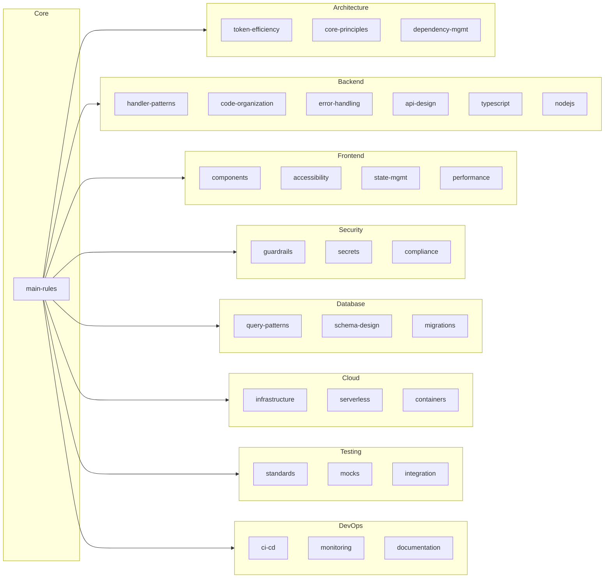

### Agents (34) — Your On-Demand Specialists

| Domain           | Agent                | Invocation              | Best For                          |
| ---------------- | -------------------- | ----------------------- | --------------------------------- |
| **Architecture** | Design Agent         | `/design-agent`         | System design, trade-off analysis |
|                  | Refactoring Agent    | `/refactoring-agent`    | Safe incremental refactoring      |
|                  | Migration Agent      | `/migration-agent`      | Framework upgrades, migrations    |
| **Backend**      | Code Reviewer        | `/code-reviewer`        | PR reviews, security checks       |
|                  | Implementation Agent | `/implementation-agent` | Building features end-to-end      |
|                  | Debugging Agent      | `/debugging-agent`      | Root cause analysis               |
|                  | API Agent            | `/api-agent`            | REST API design                   |
|                  | Performance Agent    | `/performance-agent`    | Bottleneck identification         |
|                  | Database Agent       | `/database-agent`       | Schema design, queries            |
|                  | Event Handler Agent  | `/event-handler-agent`  | Async event processing            |
| **Frontend**     | UI Component Agent   | `/ui-component-agent`   | Accessible components             |
|                  | State Agent          | `/state-agent`          | State management decisions        |
|                  | Styling Agent        | `/styling-agent`        | CSS architecture, theming         |
|                  | Frontend Perf Agent  | `/frontend-perf-agent`  | Core Web Vitals optimization      |
| **Testing**      | Testing Agent        | `/testing-agent`        | Write comprehensive tests         |
|                  | E2E Agent            | `/e2e-agent`            | End-to-end test flows             |
|                  | Load Test Agent      | `/load-test-agent`      | Performance benchmarking          |
|                  | Security Test Agent  | `/security-test-agent`  | Vulnerability scanning            |
| **Database**     | Schema Agent         | `/schema-agent`         | Schema design, ER diagrams        |
|                  | Query Opt Agent      | `/query-opt-agent`      | Query performance tuning          |
| **Security**     | Security Audit Agent | `/security-audit-agent` | Comprehensive security audit      |
|                  | Auth Agent           | `/auth-agent`           | Auth flows, RBAC                  |
|                  | Compliance Agent     | `/compliance-agent`     | GDPR, SOC 2, HIPAA                |
| **Cloud**        | Infra Agent          | `/infra-agent`          | IaC, cloud architecture           |
|                  | Deployment Agent     | `/deployment-agent`     | Zero-downtime deployments         |
|                  | Cost Agent           | `/cost-agent`           | Cloud cost optimization           |
| **DevOps**       | CI/CD Agent          | `/ci-cd-agent`          | Pipeline design                   |
|                  | Monitoring Agent     | `/monitoring-agent`     | Observability setup               |
|                  | Incident Agent       | `/incident-agent`       | Incident response                 |
| **Business**     | Requirements Agent   | `/requirements-agent`   | User stories, specs               |
|                  | Estimation Agent     | `/estimation-agent`     | Effort estimation                 |
| **AI/ML**        | Prompt Agent         | `/prompt-agent`         | Prompt engineering                |
| **Docs**         | Docs Agent           | `/docs-agent`           | Technical documentation           |
| **Platform**     | DX Agent             | `/dx-agent`             | Developer experience              |

### Commands (17) — Token-Efficient Quick Actions

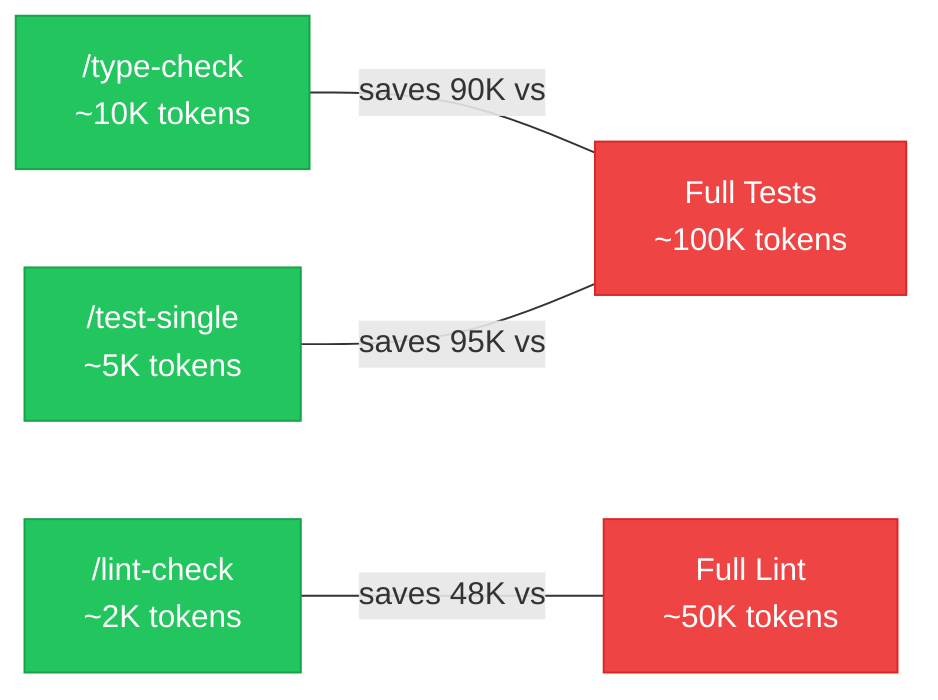

| Command             | What It Does               | Why It's Better                   |
| ------------------- | -------------------------- | --------------------------------- |
| `/type-check`       | TypeScript type validation | 10K tokens vs 100K for full tests |
| `/lint-check`       | Use `read_lints` tool      | 2K tokens vs 50K for full lint    |
| `/lint-fix`         | Auto-fix lint issues       | One-step lint resolution          |
| `/format`           | Format code files          | Consistent formatting             |
| `/generate-handler` | Scaffold API handler       | Full 9-file handler in seconds    |
| `/test-single`      | Test one file only         | 5K tokens vs 100K for full suite  |
| `/test-coverage`    | Coverage report            | Targeted coverage analysis        |
| `/coverage`         | Quick coverage check       | Fast coverage snapshot            |
| `/build`            | Build the project          | Validated production build        |
| `/deploy`           | Deploy the application     | Guided deployment flow            |
| `/docker-build`     | Build Docker image         | Correct multi-stage build         |
| `/audit-deps`       | Vulnerability scan         | Catch CVEs before shipping        |
| `/audit`            | Full security audit        | Comprehensive security check      |
| `/check-secrets`    | Secret detection           | Find leaked keys before commit    |

---

## Sharing & Team Adoption

cursor-handbook is designed to scale from solo developer to enterprise teams:

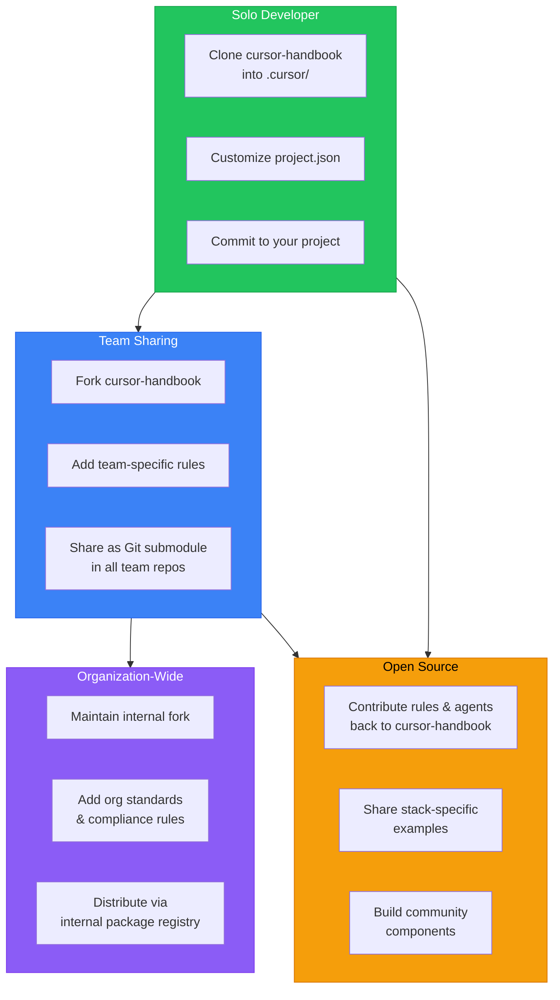

### Adoption Hierarchy

| Level            | Method                                | Best For                           |
| ---------------- | ------------------------------------- | ---------------------------------- |
| **Personal**     | Clone directly into `.cursor/`        | Solo developers, personal projects |
| **Team**         | Git submodule in shared repos         | Small teams (2-10 developers)      |
| **Organization** | Internal fork with org-specific rules | Companies with coding standards    |
| **Community**    | PR contributions to this repo         | Open source stack-specific configs |

### Team Setup (Git Submodule)

```bash
# One team member sets it up
git submodule add https://github.com/your-org/cursor-handbook.git .cursor
git commit -m "feat: add cursor-handbook for team standards"
git push

# Every other team member gets it automatically
git pull
git submodule update --init
make init

# Update across the team
cd .cursor && git pull origin main && cd ..
git add .cursor && git commit -m "chore: update cursor-handbook"
```

### Organization Fork Strategy

```bash
# 1. Fork cursor-handbook to your org
# 2. Add org-specific rules
# 3. All teams use the org fork as their submodule
git submodule add https://github.com/girijashankarj/cursor-handbook.git .cursor
```

---

## Project Structure

```
cursor-handbook/
├── .cursor/
│   ├── config/                    # project.json, schema, templates
│   │   ├── project.json.template  #   Template (start here)
│   │   ├── project.json.example   #   Complete example
│   │   └── project-schema.json    #   JSON Schema validation
│   ├── rules/                     # 30 always-applied rules
│   │   ├── main-rules.mdc        #   Master rules
│   │   ├── architecture/          #   3 architecture rules
│   │   ├── backend/               #   6 backend rules
│   │   ├── frontend/              #   4 frontend rules
│   │   ├── security/              #   3 security rules
│   │   ├── database/              #   3 database rules
│   │   ├── cloud/                 #   3 cloud rules
│   │   ├── testing/               #   3 testing rules
│   │   └── devops/                #   3 devops rules
│   ├── agents/                    # 34 specialized AI agents
│   │   ├── architecture/          #   3 agents
│   │   ├── backend/               #   7 agents
│   │   ├── frontend/              #   4 agents
│   │   ├── testing/               #   4 agents
│   │   ├── database/              #   2 agents
│   │   ├── security/              #   3 agents
│   │   ├── cloud/                 #   3 agents
│   │   ├── devops/                #   3 agents
│   │   ├── business/              #   2 agents
│   │   ├── ai-ml/                 #   1 agent
│   │   ├── documentation/         #   1 agent
│   │   └── platform/              #   1 agent
│   ├── skills/                    # 22 guided workflows
│   ├── commands/                  # 14 quick actions
│   ├── hooks/                     # 12 automation scripts
│   ├── templates/                 # 9 code templates
│   └── settings/                  # IDE settings
├── docs/                          # Full documentation
│   ├── getting-started/           #   Quick start & setup
│   ├── components/                #   Component guides
│   ├── guides/                    #   Best practices
│   ├── security/                  #   Security guide
│   └── reference/                 #   Schema & reference
├── examples/                      # 9 stack-specific presets
├── scripts/                       # Setup scripts
├── .cursorignore                  # AI context exclusions
├── AGENTS.md                      # Agent instructions
├── CLAUDE.md                      # Claude-specific instructions
├── CONTRIBUTING.md                # Contribution guide
├── COMPONENT_INDEX.md             # Full component reference
├── LICENSE                        # MIT License
└── README.md                      # You are here
```

---

## Why You Should Use This

### For Individual Developers

- **Save money** — 30%+ reduction in token costs adds up fast
- **Save time** — Stop repeating your standards every session
- **Better code** — AI follows your patterns, not random internet patterns
- **Security by default** — Guardrails prevent accidental secret leaks
- **Instant scaffolding** — Full handler/component in seconds, not minutes

### For Teams

- **Consistency** — Every developer gets the same AI behavior
- **Onboarding** — New team members get productive on day one
- **Standards enforcement** — Rules apply automatically, no code review friction
- **Institutional knowledge** — Your patterns are codified, not tribal knowledge
- **Cost control** — Token savings compound across the whole team

### For Organizations

- **Compliance** — Security and data handling rules are always enforced
- **Scalability** — Same standards across 10 projects or 1,000
- **Governance** — Central control over AI behavior across all teams
- **ROI** — Measurable token savings and developer time savings
- **Risk reduction** — No more hardcoded secrets or PII in logs

### By The Numbers

| Metric                      | Value              |
| --------------------------- | ------------------ |
| Components                  | 117                |
| Supported tech stacks       | 9                  |
| Token savings per operation | 67-96%             |
| Setup time                  | ~5 minutes         |
| Files to customize          | 1 (`project.json`) |
| Lines to edit               | ~50                |
| Price                       | Free (MIT License) |

---

## Contributing

We welcome contributions. Whether it's a new rule for a framework we don't cover, a new agent for a workflow you've mastered, or a bug fix — every contribution helps the community.

See [CONTRIBUTING.md](CONTRIBUTING.md) for guidelines.


**High-impact areas for contribution:**

- New stack-specific examples (Vue, Django, Rails, Spring, etc.)
- Specialized agents for niche domains (ML pipelines, game dev, embedded)
- Translations of documentation
- Performance benchmarks and case studies

---

## Documentation

| Document                                                      | Description                          |
| ------------------------------------------------------------- | ------------------------------------ |
| [Architecture](ARCHITECTURE.md)                               | System design, data flow, extension points |
| [Quick Start](docs/getting-started/quick-start.md)            | Get running in 5 minutes             |
| [Project Setup](docs/getting-started/configuration.md)        | Customize rules to your stack        |
| [Component Overview](docs/components/overview.md)             | How components work together         |
| [Component readiness](docs/component-readiness.md)           | Production-ready, generic components list |
| [Best Practices](docs/guides/best-practices.md)               | Get the most out of cursor-handbook  |
| [Cursor usage](docs/guides/cursor-usage.md)                  | Token usage, agent review, BugBot setup |
| [Claude IDE support](docs/guides/claude-ide-support.md)       | Use with Claude Code and other IDEs  |
| [Security Guide](docs/security/security-guide.md)             | Security features and policies       |
| [Schema Reference](docs/reference/configuration-reference.md)  | Full `project.json` schema           |
| [Component Index](COMPONENT_INDEX.md)                         | Complete list of all 117 components  |
| [Handbook website](https://girijashankarj.github.io/cursor-handbook/) | **Browse** (components) and **Guidelines** (Cursor IDE topics); search; copy paths (GitHub Pages) |
| [Cursor guidelines](docs/cursor-guidelines/README.md) | Settings, rules, skills, agents, hooks, token efficiency, security, MCP, comparisons, workflow examples |
| [Non-technical guide](docs/getting-started/non-technical.md) | Using cursor-handbook without writing code |
| [SDLC role map](docs/reference/sdlc-role-map.md)              | Components by role (PM, QA, DevOps, …) |
| [Contributing](CONTRIBUTING.md)                               | How to contribute                    |
| [Contribution Examples](docs/guides/contribution-examples.md) | Concrete examples of adding components |

**Handbook website (GitHub Pages):** [girijashankarj.github.io/cursor-handbook](https://girijashankarj.github.io/cursor-handbook/) is built from `main` by [`.github/workflows/pages.yml`](.github/workflows/pages.yml). In the repository **Settings → Pages**, set **Source** to **GitHub Actions** once so deployments appear.

---

## License

[MIT License](LICENSE) — use freely in personal and commercial projects. No attribution required (but appreciated).

---

<p align="center">
  <strong>Stop teaching your AI the same things twice.</strong><br/>
  Clone cursor-handbook, set your project once, and let 117 components work for you — every prompt, every project, every day.
</p>

<p align="center">
  <a href="#quick-start-5-minutes">Get Started</a> &nbsp;&bull;&nbsp;
  <a href="COMPONENT_INDEX.md">Browse Components</a> &nbsp;&bull;&nbsp;
  <a href="CONTRIBUTING.md">Contribute</a> &nbsp;&bull;&nbsp;
  <a href="docs/getting-started/quick-start.md">Documentation</a>
</p>
