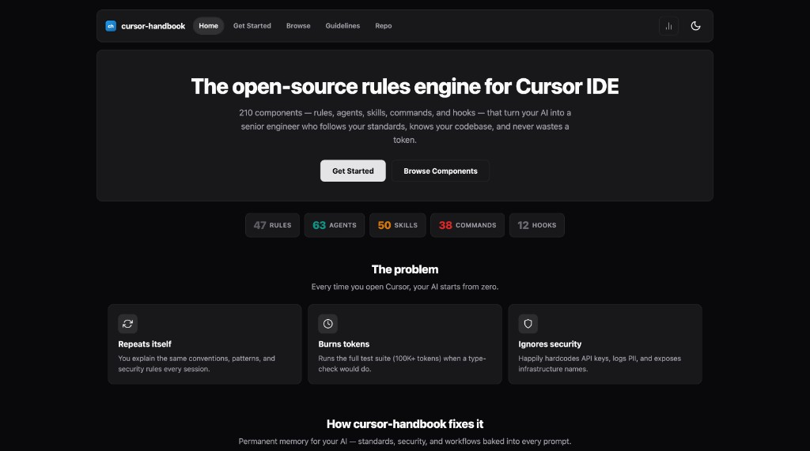
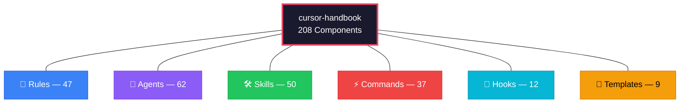
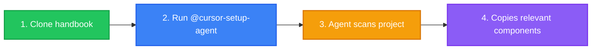
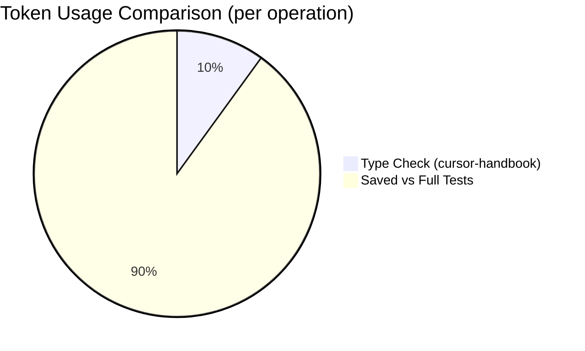
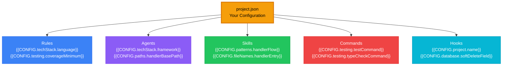
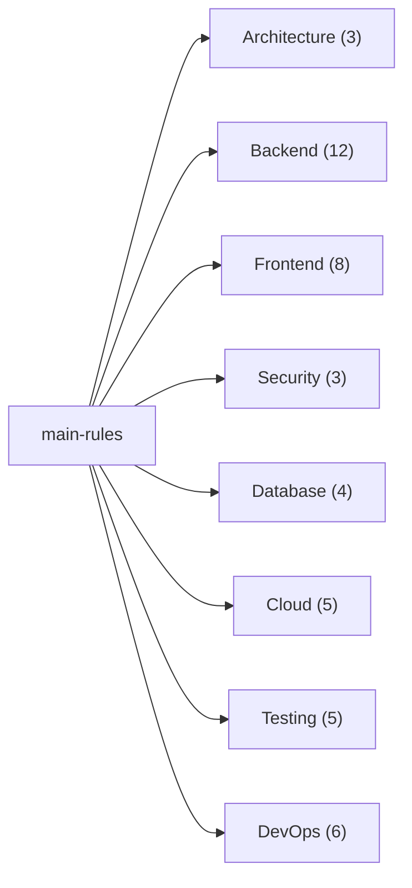
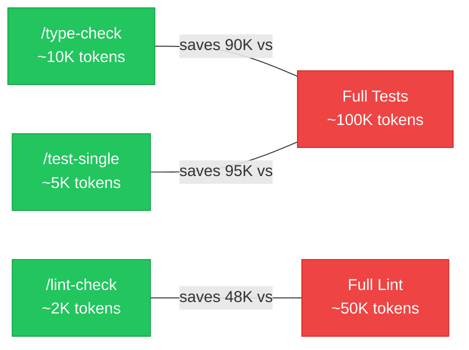
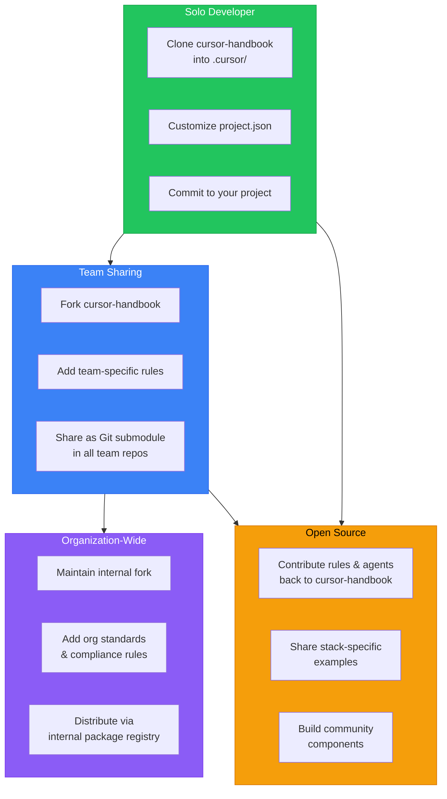

<p align="center">
  <a href="https://www.npmjs.com/package/cursor-handbook"></a>
  <a href="https://www.npmjs.com/package/cursor-handbook"></a>
  <a href="https://github.com/girijashankarj/cursor-handbook/stargazers"></a>
  <a href="https://github.com/girijashankarj/cursor-handbook/fork"></a>
  <a href="https://github.com/girijashankarj/cursor-handbook/commits/main"></a>
  <a href="https://github.com/girijashankarj/cursor-handbook/issues"></a>
  <a href="https://github.com/girijashankarj/cursor-handbook/blob/main/LICENSE"></a>
  
  
  
</p>

# cursor-handbook

🌐 **Live handbook:** [https://girijashankarj.github.io/cursor-handbook/](https://girijashankarj.github.io/cursor-handbook/)

<p align="center">
  <a href="https://girijashankarj.github.io/cursor-handbook/">
    
  </a>
</p>

**The open-source rules engine for Cursor IDE — 208 components (rules, agents, skills, commands, hooks) that turn your AI into a senior engineer who follows your standards, knows your codebase, and never wastes a token.**

> Stop teaching your AI the same things every session. cursor-handbook gives Cursor permanent memory of your standards, security policies, and workflows — across every project, every team member, every prompt.

<p align="center">
  <strong>If cursor-handbook helps you, consider giving it a ⭐ — it helps others discover it.</strong>
</p>

---

## Table of Contents

- [Ways to use](#ways-to-use-cursor-handbook)
- [The Problem](#the-problem)
- [Before vs After](#before-vs-after)
- [Who is this for?](#who-is-this-for)
- [How It Works](#how-it-works)
- [What's Inside](#whats-inside)
- [Quick Start](#quick-start-5-minutes)
- [Cursor Setup Agent](#using-the-cursor-setup-agent)
- [Component Deep Dive](#component-deep-dive)
- [Documentation](#documentation)

---

## Ways to use cursor-handbook

Pick the option that fits your workflow:

> **Recommended:** Run `npx cursor-handbook init` — it copies the `.cursor/` folder into your project. Then use `@cursor-setup-agent` in Cursor to keep only the components you need.

| Option                             | Best for                                                                                                                                                                                                                                                                                                                                                   |
| ---------------------------------- | ---------------------------------------------------------------------------------------------------------------------------------------------------------------------------------------------------------------------------------------------------------------------------------------------------------------------------------------------------------- |
| **1. [npm](https://www.npmjs.com/package/cursor-handbook)** ⭐ | **Fastest approach.** Run `npx cursor-handbook init`, use `@cursor-setup-agent` to keep only what you need, then `npm uninstall cursor-handbook`. See [Quick Start](#quick-start-5-minutes). |
| **2. Cursor Setup Agent**       | **Smartest approach.** Clone this repo, open your project in Cursor, then run `@cursor-setup-agent`. The agent scans your codebase, detects your language/framework/database/CI stack, selects only relevant components, generates `project.json`, and copies everything into `.cursor/` — in one step. See [how it works](#using-the-cursor-setup-agent). |
| **3. Clone & copy**                | Use the full rules engine in your repo. Clone this repo, copy the `.cursor` folder into your project, then edit `project.json` and tailor rules/agents/skills to your stack.                                                                                                                                                                               |
| **4. Add from GitHub (Cursor UI)** | Use rules, skills, or agents without cloning. In Cursor IDE go to **Settings → Rules / Skills / Agents**, click **Add new → Add from GitHub**, and paste this repo’s clone URL. Add only what you need.                                                                                                                                                    |
| **5. Fork or pick & choose** | Fork this repo for your team, or download only the individual components you need and drop them into your existing `.cursor` setup. |
| **6. Handbook website**       | **Browse** components or read **Guidelines** (Cursor IDE topics) in the browser — **[GitHub Pages](https://girijashankarj.github.io/cursor-handbook/)**. |

**Improvements welcome.** See [CONTRIBUTING.md](CONTRIBUTING.md) to add or improve rules, skills, hooks, agents, or commands.

---

## The Problem

Every time you open Cursor IDE, your AI assistant starts from zero. It doesn't know your:

- Code conventions and architecture patterns
- Security policies (and happily hardcodes your API keys)
- Testing thresholds (and runs the full 100K-token test suite when you just wanted a type check)
- Handler patterns, naming conventions, or folder structure

You end up repeating yourself, burning tokens, and fixing the same mistakes. **cursor-handbook fixes this permanently.**

---

## Before vs After

| Before cursor-handbook                 | After cursor-handbook                       |
| -------------------------------------- | ------------------------------------------- |
| AI hardcodes API keys                  | Security rules block it                     |
| AI runs full test suite (~100K tokens) | Uses type-check (~10K) or single-file tests |
| You repeat conventions every session   | Rules remember them — always on             |
| Inconsistent code across team          | One rules engine, one standard              |
| No guardrails on expensive ops         | Hooks warn or block dangerous commands      |

---

## Who is this for?

| Audience            | Benefit                                                             |
| ------------------- | ------------------------------------------------------------------- |
| **Solo developers** | Consistent AI behavior without repeating yourself every session     |
| **Teams**           | Shared standards; everyone gets the same guardrails and conventions |
| **Enterprises**     | Security, compliance, and token efficiency built in from day one    |

---

## How It Works


**Layer 1 — Pre-Processing:** Hooks inject project context and block dangerous commands before your prompt reaches the AI.
**Layer 2 — Rules Engine:** 47 always-on rules enforce token efficiency, security, architecture, code standards, database conventions, and testing thresholds.
**Layer 3 — Specialized Processing:** The right component activates — an agent, skill, or command — based on your prompt.
**Layer 4 — Post-Processing:** Hooks validate output, auto-format, scan for secrets, and verify coverage.

### Typical Workflows

| What You Want        | What You Type                    | What Happens                                                   |
| -------------------- | -------------------------------- | -------------------------------------------------------------- |
| Build a new endpoint | "Create a POST /orders endpoint" | Skill triggers full handler scaffolding (9 files, 7-step flow) |
| Review code          | `/code-reviewer`                 | Agent checks security, performance, correctness, tests         |
| Fix broken tests     | `/testing-agent fix these tests` | Skill diagnoses failures, fixes mocks, verifies coverage       |
| Quick validation     | `/type-check`                    | Runs type check (~10K tokens) instead of full tests (~100K)    |
| Deploy safely        | `/deployment-agent`              | Agent generates deployment checklist with rollback plan        |
| Optimize a query     | `/query-opt-agent`               | Agent runs EXPLAIN ANALYZE, rewrites query, adds indexes       |

---

## What's Inside



| Layer         | Count | What It Does                                      | How It's Triggered                  |
| ------------- | ----- | ------------------------------------------------- | ----------------------------------- |
| **Rules**     | 47    | Enforces coding standards on every AI interaction | Automatically — always on           |
| **Agents**    | 62    | Specialized assistants for complex tasks          | On demand — `/agent-name`           |
| **Skills**    | 50    | Step-by-step guided workflows with checklists     | Contextually — when patterns match  |
| **Commands**  | 37    | Lightweight, token-efficient quick actions        | On demand — `/command`              |
| **Hooks**     | 12    | Automation scripts in the AI loop                 | Event-driven — before/after actions |
| **Templates** | 9     | Scaffolding for handlers, components, tests, etc. | Referenced by skills and agents     |

---

## Quick Start (5 minutes)


### npm (Recommended)

> **npm package:** [npmjs.com/package/cursor-handbook](https://www.npmjs.com/package/cursor-handbook)

```bash
npx cursor-handbook init
```

You'll be prompted to either **copy all** components or **select by category** (frontend, backend, database, cloud, testing, devops, etc.). To skip the prompt:

```bash
npx cursor-handbook init --all    # copy everything
```

Then:

1. Edit `.cursor/config/project.json` — replace `{{PLACEHOLDER}}` values with your project details
2. Restart Cursor IDE
3. Use `@cursor-setup-agent` to further customize components
4. Remove the package: `npm uninstall cursor-handbook`

Or install explicitly, then initialize:

```bash
npm install -D cursor-handbook
npx cursor-handbook init
# After setup, remove:
npm uninstall cursor-handbook
```

### Alternative: Clone & copy

```bash
git clone https://github.com/girijashankarj/cursor-handbook.git .cursor && make -f .cursor/Makefile init
```

Then edit `.cursor/config/project.json` and restart Cursor.

> For additional setup methods (curl one-liner, Git submodule for teams), see [Quick Start docs](docs/getting-started/quick-start.md).

---

## Using the Cursor Setup Agent

The **Cursor Setup Agent** is the recommended way to adopt cursor-handbook. Instead of manually choosing which components to copy, the agent does it for you.

### How it works



1. **Clone** cursor-handbook alongside your project (or into a temp directory)
2. **Open your project** in Cursor IDE
3. **Run** `@cursor-setup-agent` in the Cursor chat
4. The agent will:

- Detect your language, framework, database, testing, CI/CD, and cloud stack
- Build a component manifest with only the relevant rules, agents, skills, commands, hooks, and templates
- Show you a summary table and ask for confirmation before copying anything
- Generate a tailored `project.json`, `CLAUDE.md`, and `AGENTS.md`
- Print a post-setup checklist

### What it detects

| Category           | Signals                                                                                    |
| ------------------ | ------------------------------------------------------------------------------------------ |
| **Language**       | `tsconfig.json`, `go.mod`, `Cargo.toml`, `requirements.txt`, `pom.xml`, file extensions    |
| **Framework**      | Dependencies in `package.json` / `requirements.txt` (React, Express, Django, Spring, etc.) |
| **Database**       | ORM configs (`prisma/`, `sequelize`, `typeorm`), `.sql` files, migration folders           |
| **Testing**        | `jest.config.`_, `vitest`, `pytest`, `cypress/`, `playwright.config._`                     |
| **Infrastructure** | `Dockerfile`, `terraform/`, `cdk.json`, `serverless.yml`, cloud SDK deps                   |
| **CI/CD**          | `.github/workflows/`, `.gitlab-ci.yml`, `Jenkinsfile`                                      |

### Example

For a **TypeScript + Express + PostgreSQL + Jest + Docker** project, the agent would install ~120 targeted components (out of 209) and skip irrelevant ones like `react.mdc`, `angular.mdc`, `python.mdc`, and `go.mdc`.

> **Full agent spec:** [.cursor/agents/cursor-setup-agent.md](.cursor/agents/cursor-setup-agent.md)

---

## Token Savings

cursor-handbook is engineered to cut your AI token costs by 30% or more:



| Without cursor-handbook         | With cursor-handbook                   | Tokens Saved   |
| ------------------------------- | -------------------------------------- | -------------- |
| Full test suite: ~100K tokens   | `/type-check`: ~10K tokens             | **~90K (90%)** |
| Full lint run: ~50K tokens      | `/lint-check` (read_lints): ~2K tokens | **~48K (96%)** |
| Full test suite: ~100K tokens   | `/test-single`: ~5K tokens             | **~95K (95%)** |
| Unfiltered context: ~30K tokens | Context layering: ~10K tokens          | **~20K (67%)** |
| Verbose AI output: ~15K tokens  | Concise guidelines: ~5K tokens         | **~10K (67%)** |

**Conservative estimate**: A developer making 50 AI interactions/day saves **~200K tokens/day** — that's real money at scale.

---

## Customization

cursor-handbook is 100% project-driven. Every component adapts to your project through a single file:

### How It Adapts to Your Project



### What You Can Customize

| Section       | What It Controls           | Example                                        |
| ------------- | -------------------------- | ---------------------------------------------- |
| `project`     | Project identity           | Name, description, repo URL                    |
| `techStack`   | Language, framework, tools | TypeScript + Express or Python + FastAPI       |
| `paths`       | Directory structure        | Where handlers, services, and common code live |
| `domain`      | Business entities          | Order, Product, Customer + lifecycle states    |
| `patterns`    | Code patterns              | 7-step handler flow, error handling strategy   |
| `testing`     | Quality gates              | 90% coverage, test/lint/type-check commands    |
| `database`    | DB conventions             | Soft delete field, timestamp columns, naming   |
| `packages`    | Internal packages          | `@your-org` scope, registry URL                |
| `conventions` | Git and workflow           | Branch prefixes, commit format, PR templates   |

### Ready-Made Stack Presets

Don't start from scratch — pick your stack:

| Stack              | File                                                           | Language   | Framework   |
| ------------------ | -------------------------------------------------------------- | ---------- | ----------- |
| TypeScript/Express | `[examples/typescript-express/](examples/typescript-express/)` | TypeScript | Express.js  |
| TypeScript/NestJS  | `[examples/typescript-nest/](examples/typescript-nest/)`       | TypeScript | NestJS      |
| Python/FastAPI     | `[examples/python-fastapi/](examples/python-fastapi/)`         | Python     | FastAPI     |
| Go/Chi             | `[examples/go-chi/](examples/go-chi/)`                         | Go         | Chi         |
| React SPA          | `[examples/react/](examples/react/)`                           | TypeScript | React       |
| Next.js            | `[examples/nextjs/](examples/nextjs/)`                         | TypeScript | Next.js     |
| Rust/Actix         | `[examples/rust-actix/](examples/rust-actix/)`                 | Rust       | Actix Web   |
| Kotlin/Spring      | `[examples/kotlin-spring/](examples/kotlin-spring/)`           | Kotlin     | Spring Boot |
| Flutter            | `[examples/flutter/](examples/flutter/)`                       | Dart       | Flutter     |

Copy a preset and customize: `cp examples/typescript-express/project.json .cursor/config/project.json`

---

## Component Deep Dive

### Rules (47) — Your AI's Permanent Memory

Rules are the backbone. They load on every interaction, every time, with zero effort.



### Agents (62) — Your On-Demand Specialists

| Domain           | Agent                | Invocation              | Best For                          |
| ---------------- | -------------------- | ----------------------- | --------------------------------- |
| **Architecture** | Design Agent         | `/design-agent`         | System design, trade-off analysis |
| **Backend**      | Code Reviewer        | `/code-reviewer`        | PR reviews, security checks       |
| **Frontend**     | UI Component Agent   | `/ui-component-agent`   | Accessible components             |
| **Testing**      | Testing Agent        | `/testing-agent`        | Write comprehensive tests         |
| **Database**     | Query Opt Agent      | `/query-opt-agent`      | Query performance tuning          |
| **Security**     | Security Audit Agent | `/security-audit-agent` | Comprehensive security audit      |
| **Cloud**        | Deployment Agent     | `/deployment-agent`     | Zero-downtime deployments         |
| **DevOps**       | CI/CD Agent          | `/ci-cd-agent`          | Pipeline design                   |
| **Business**     | Requirements Agent   | `/requirements-agent`   | User stories, specs               |
| **AI/ML**        | Prompt Agent         | `/prompt-agent`         | Prompt engineering                |
| **Docs**         | Docs Agent           | `/docs-agent`           | Technical documentation           |
| **Platform**     | DX Agent             | `/dx-agent`             | Developer experience              |

> See [COMPONENT_INDEX.md](COMPONENT_INDEX.md) for all 62 agents.

### Commands (37) — Token-Efficient Quick Actions



| Command             | What It Does               | Why It's Better                   |
| ------------------- | -------------------------- | --------------------------------- |
| `/type-check`       | TypeScript type validation | 10K tokens vs 100K for full tests |
| `/lint-check`       | Use `read_lints` tool      | 2K tokens vs 50K for full lint    |
| `/generate-handler` | Scaffold API handler       | Full 9-file handler in seconds    |
| `/test-single`      | Test one file only         | 5K tokens vs 100K for full suite  |
| `/audit-deps`       | Vulnerability scan         | Catch CVEs before shipping        |
| `/check-secrets`    | Secret detection           | Find leaked keys before commit    |

> See [COMPONENT_INDEX.md](COMPONENT_INDEX.md) for all 37 commands.

---

## Sharing & Team Adoption

cursor-handbook is designed to scale from solo developer to enterprise teams:



### Adoption Hierarchy

| Level            | Method                                | Best For                           |
| ---------------- | ------------------------------------- | ---------------------------------- |
| **Personal**     | Clone directly into `.cursor/`        | Solo developers, personal projects |
| **Team**         | Git submodule in shared repos         | Small teams (2-10 developers)      |
| **Organization** | Internal fork with org-specific rules | Companies with coding standards    |
| **Community**    | PR contributions to this repo         | Open source stack-specific configs |

### Team Setup (Git Submodule)

```bash
git submodule add https://github.com/your-org/cursor-handbook.git .cursor
git commit -m "feat: add cursor-handbook for team standards" && git push

# Other team members
git pull && git submodule update --init && make init
```

---

## Project Structure

```
cursor-handbook/
├── .cursor/
│   ├── config/            # project.json, schema, templates
│   ├── rules/             # 47 always-applied and scoped rules
│   ├── agents/            # 62 specialized AI agents
│   ├── skills/            # 50 guided workflows
│   ├── commands/          # 37 quick actions
│   ├── hooks/             # 12 automation scripts
│   ├── templates/         # 9 code templates
│   └── settings/          # IDE settings
├── docs/                  # Full documentation
├── examples/              # 9 stack-specific presets
├── scripts/               # Setup scripts
├── AGENTS.md              # Agent instructions
├── CLAUDE.md              # Claude-specific instructions
├── CONTRIBUTING.md        # Contribution guide
├── COMPONENT_INDEX.md     # Full component reference
├── LICENSE                # MIT License
└── README.md              # You are here
```

---

## Why You Should Use This

| Audience             | Key Benefits                                                                                      |
| -------------------- | ------------------------------------------------------------------------------------------------- |
| **Individual**       | 30%+ token savings, stop repeating standards, security guardrails, instant scaffolding            |
| **Teams**            | Consistent AI behavior, day-one onboarding, codified patterns, compounding cost savings           |
| **Organizations**    | Always-on compliance, same standards across 1,000 projects, central governance, measurable ROI    |

### By The Numbers

| Metric                      | Value              |
| --------------------------- | ------------------ |
| Components                  | 208                |
| Supported tech stacks       | 9                  |
| Token savings per operation | 67-96%             |
| Setup time                  | ~5 minutes         |
| Files to customize          | 1 (`project.json`) |
| Lines to edit               | ~50                |
| Price                       | Free (MIT License) |

---

## Contributing

See [CONTRIBUTING.md](CONTRIBUTING.md) for guidelines.


**High-impact areas for contribution:**

- New stack-specific examples (Vue, Django, Rails, Spring, etc.)
- Specialized agents for niche domains (ML pipelines, game dev, embedded)
- Translations of documentation
- Performance benchmarks and case studies

---

## Documentation

| Document                                                              | Description                                                                                       |
| --------------------------------------------------------------------- | ------------------------------------------------------------------------------------------------- |
| [Architecture](ARCHITECTURE.md)                                       | System design, data flow, extension points                                                        |
| [Quick Start](docs/getting-started/quick-start.md)                    | Get running in 5 minutes                                                                          |
| [Project Setup](docs/getting-started/configuration.md)                | Customize rules to your stack                                                                     |
| [Component Overview](docs/components/overview.md)                     | How components work together                                                                      |
| [Best Practices](docs/guides/best-practices.md)                       | Get the most out of cursor-handbook                                                               |
| [Security Guide](docs/security/security-guide.md)                     | Security features and policies                                                                    |
| [Schema Reference](docs/reference/configuration-reference.md)         | Full `project.json` schema                                                                        |
| [Component Picker](docs/guides/component-picker.md)                   | Find the right components for your project type                                                   |
| [Component Index](COMPONENT_INDEX.md)                                 | Complete list of all 208 components                                                               |
| [Handbook website](https://girijashankarj.github.io/cursor-handbook/) | Browse components, read guidelines, search and copy paths                                         |
| [Cursor guidelines](docs/cursor-guidelines/README.md)                 | Settings, rules, skills, agents, hooks, token efficiency, security, MCP, comparisons, workflows   |
| [Non-technical guide](docs/getting-started/non-technical.md)          | Using cursor-handbook without writing code                                                        |
| [Contributing](CONTRIBUTING.md)                                       | How to contribute                                                                                 |

**Handbook website (GitHub Pages):** [girijashankarj.github.io/cursor-handbook](https://girijashankarj.github.io/cursor-handbook/) is built from `main` by `[.github/workflows/pages.yml](.github/workflows/pages.yml)`. In the repository **Settings → Pages**, set **Source** to **GitHub Actions** once so deployments appear.

---

## Acknowledgments

Built for **[Cursor IDE](https://cursor.com)** — thanks to the Cursor team for building the AI-first code editor that makes projects like this possible. cursor-handbook exists because Cursor's rules, agents, skills, and hooks architecture gives developers real control over their AI workflows.

---

## License

[MIT License](LICENSE) — use freely in personal and commercial projects. No attribution required (but appreciated).

---

**Stop teaching your AI the same things twice.**  
Clone cursor-handbook, set your project once, and let 208 components work for you — every prompt, every project, every day.

[Get Started](#quick-start-5-minutes)  •  [npm Package](https://www.npmjs.com/package/cursor-handbook)  •  [Browse Components](COMPONENT_INDEX.md)  •  [Contribute](CONTRIBUTING.md)  •  Documentation
