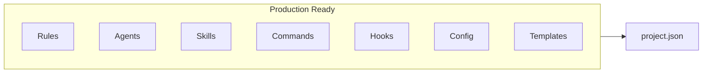

# Component readiness

Summary of cursor-handbook components and their status. All listed components are **production-ready** and **generic** — they work across projects and tech stacks; customize via `project.json` and optional edits to rules/agents/skills.

## Components

| Component | Location | Status |
|-----------|----------|--------|
| Rules | `.cursor/rules/` | Ready — 31 rules |
| Agents | `.cursor/agents/` | Ready — 34 agents |
| Skills | `.cursor/skills/` | Ready — 23 skills |
| Commands | `.cursor/commands/` | Ready — format, lint, type-check, build, deploy, audit, commit-message, pr-description, fix-vulnerable-deps, coverage |
| Hooks | `.cursor/hooks/` | Ready — format, lint-check, type-check, scan-secrets, validate-sql, etc. |
| Config | `.cursor/config/` | Ready — project.json, schema, templates |
| Settings | `.cursor/settings/` | Ready — cursor-settings, keybindings, tasks |
| Templates | `.cursor/templates/` | Ready — handler, service, test, Dockerfile, migration, component |

## Docs

| Doc set | Status |
|---------|--------|
| Getting started | Ready — quick-start, setup, prerequisites, faq, migration, troubleshooting |
| Components | Ready — overview, agents, commands, hooks, rules, skills |
| Guides / AI adoption | Ready — cursor-ai, genai, token-efficiency, workflows, etc. |
| Reference | Ready — configuration, examples, glossary, tech-stacks, roadmap |
| Security | Ready — security-guide, sast-integration, security-compliance |

Update this table when adding or deprecating components.
