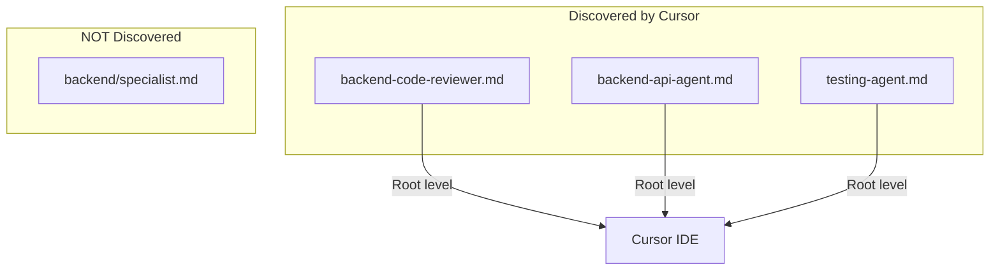

# Agents

Agents are specialized AI assistants defined in `.cursor/agents/`. **Cursor discovers agents only when they are at the root of the agents folder** — not in subdirectories.

Each agent is a `.md` file at `.cursor/agents/<name>.md` (e.g. `backend-code-reviewer.md`). Each has a focused role and is invoked when the user selects it or references it in chat.

## Usage

### How to invoke agents

| Method | Example |
|--------|---------|
| **Chat mention** | "Use the code-reviewer agent" or "@code-reviewer" |
| **Agent picker** | Cursor Settings → Agents → select agent; or use the agent dropdown in chat |
| **Explicit request** | "Run the backend-api-agent on this endpoint" |

### Naming convention

- **File name**: `{domain}-{purpose}-agent.md` (e.g. `backend-code-reviewer.md`, `testing-agent.md`)
- **Invocation**: Use the agent's purpose or short name (e.g. `/code-reviewer`, `/api-agent`)
- **Root level only**: Cursor discovers agents only at `.cursor/agents/*.md` — not in subdirectories

### Purpose

Get consistent, domain-specific behavior (e.g. code review, migration, security audit) instead of generic answers.

### Agent review from the Git tab

You can run an AI review on your staged changes directly from Cursor's Git tab. See [Agent review from the Git tab](../guides/cursor-usage.md#agent-review-from-the-git-tab) for steps.

## Structure

Agents are Markdown files (`.md`) that describe:

- When to use the agent
- Expected inputs and outputs
- Steps or constraints the AI should follow
- Links to related rules or skills

See `.cursor/agents/` for the full list and `docs/components/overview.md` for the component map.
