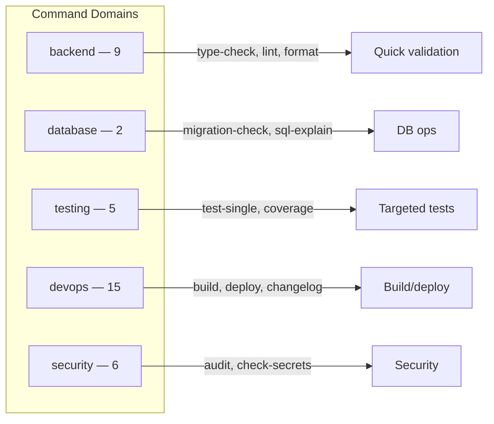

# Commands

Commands are quick-action Markdown files in `.cursor/commands/` that tell the AI how to run a specific task (e.g. format, lint, type-check, build, deploy, audit, coverage). They are lightweight and token-efficient.

> **Commands vs Skills:** Commands are single-step quick actions (low token cost). Skills are multi-step guided workflows with checklists and validation. Some domains have both — use the command for a fast result, or the skill for a thorough walkthrough.

## Usage

- **Invoke**: Ask Cursor to run the command by name (e.g. "Run format" or "Run type-check").
- **Purpose**: Standardize how common tasks are executed so the AI uses the right script and scope.

## Structure

Commands are organized by domain:

- **backend/** — type-check, lint-check, lint-fix, format, generate-handler, complexity, dead-code, feature-flag, regex
- **database/** — migration-check, sql-explain
- **testing/** — test-single, coverage, mock-data, api-test, benchmark
- **devops/** — build, deploy, docker-build, docker-compose, commit-message, pr-description, changelog, release, jira-ticket, automate, cron, git-cleanup, json-diff, openapi-spec, rollback-plan
- **security/** — audit, audit-deps, check-secrets, fix-vulnerable-deps, env-check, redact

Each command file describes the exact steps (e.g. `npm run type-check`) and any scope limits (e.g. backend paths only).

See [COMPONENT_INDEX.md](../../COMPONENT_INDEX.md#commands-37) for the complete list with invocations.
