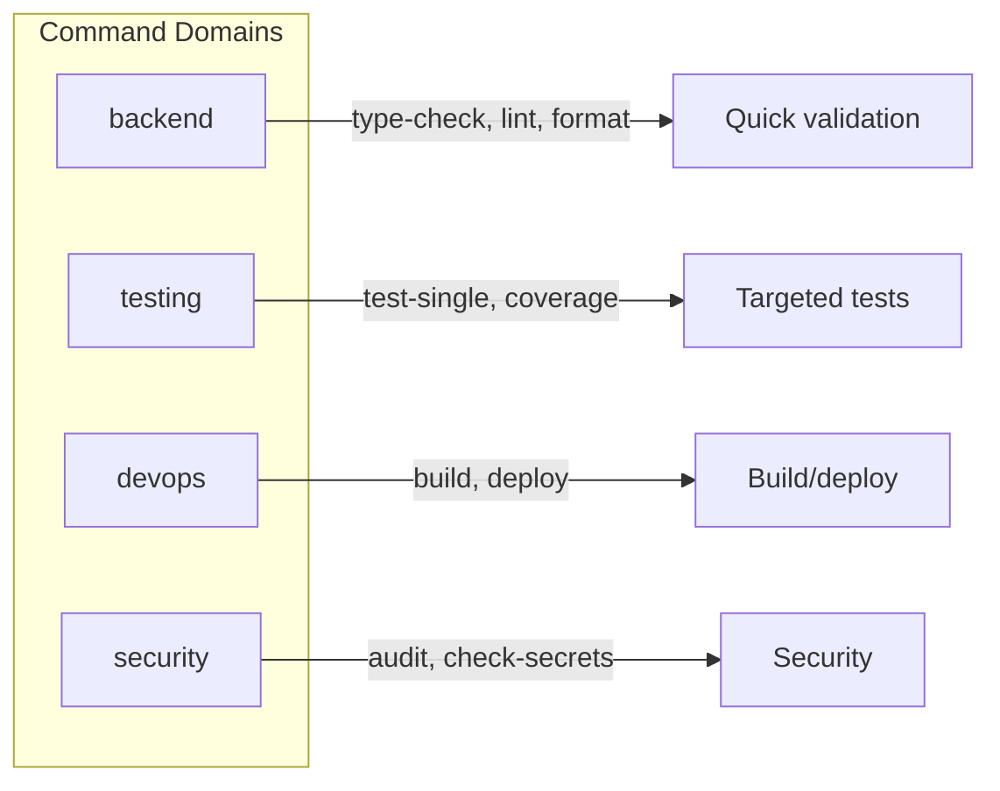

# Commands

Commands are quick-action Markdown files in `.cursor/commands/` that tell the AI how to run a specific task (e.g. format, lint, type-check, build, deploy, audit, coverage).

## Usage

- **Invoke**: Ask Cursor to run the command by name (e.g. "Run format" or "Run type-check").
- **Purpose**: Standardize how common tasks are executed so the AI uses the right script and scope.

## Structure

Commands are organized by domain:

- **backend/** — type-check, lint-check, lint-fix, format, generate-handler
- **testing/** — test-single, test-coverage, coverage
- **devops/** — build, deploy, docker-build
- **security/** — audit, audit-deps, check-secrets

Each command file describes the exact steps (e.g. `npm run type-check`) and any scope limits (e.g. backend paths only).
