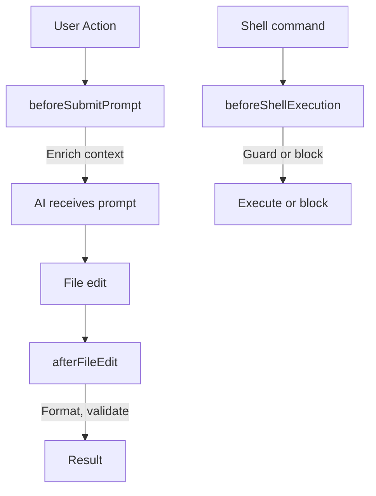

# Hooks

Hooks are shell scripts in `.cursor/hooks/` that run at specific points in the Cursor workflow (e.g. before submitting a prompt, after editing a file, before running a shell command).

## Configuration

Hooks are registered in **`.cursor/hooks.json`** (project root). Cursor expects `version: 1` and command arrays per event. See [Cursor-Recognized Files](../reference/cursor-recognized-files.md) for the exact format.



- **beforeSubmitPrompt** — Enrich context before the AI receives the prompt
- **afterFileEdit** — Format or run light checks after a file is edited
- **beforeShellExecution** — Guard dangerous commands or run validation

## Scripts

See `.cursor/hooks/README.md` for the list of scripts (format-on-edit, lint-check, type-check, scan-secrets, validate-sql, etc.) and how to enable or disable them.

## Making scripts executable

**Hooks will not run until scripts are executable.** Run this after cloning or adding new hook scripts:

```bash
chmod +x .cursor/hooks/*.sh
```

## Secret-scanning hooks (blocking)

`scan-secrets.sh` and `pre-commit-check.sh` **exit 1** when secrets are detected, blocking the action. To warn without blocking, set:

```bash
export CURSOR_HOOK_SECRETS_WARN_ONLY=1
```
