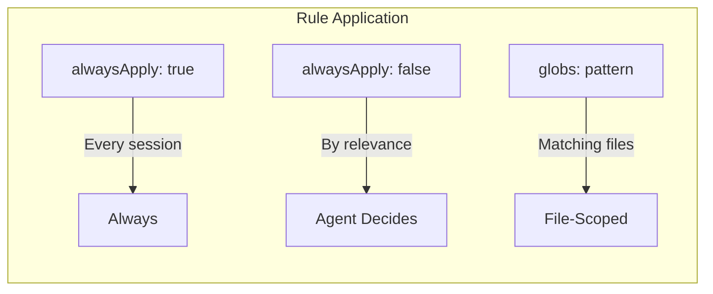

# Rules

Rules are always-applied workspace standards stored as `.md` or `.mdc` (Markdown Component) files in `.cursor/rules/`. Cursor loads them automatically and applies them to every AI interaction.

## Cursor-Recognized Keywords

Rules support YAML frontmatter with these keywords:

| Keyword | Type | Description |
|---------|------|-------------|
| `alwaysApply` | boolean | `true` = apply to every chat; `false` = Agent decides by relevance |
| `description` | string | Used when `alwaysApply: false` — Agent uses this to decide relevance |
| `globs` | string/array | File patterns (e.g. `src/**/*.ts`) — rule applies when matching files are in context |

See [Cursor-Recognized Files and Keywords](../reference/cursor-recognized-files.md) for the full reference and official Cursor docs links.

## Purpose

- **Token efficiency** — Reduce unnecessary context and long outputs
- **Security** — No hardcoded secrets, no PII in logs
- **Code organization** — Handler pattern, soft delete, structured logging
- **Testing** — Coverage targets, mocking, integration test patterns
- **API and DB** — REST conventions, migrations, query patterns

## Structure

Rules are grouped by domain (architecture, backend, cloud, database, devops, frontend, security, testing). The main entry is `main-rules.mdc`; other files refine behavior for specific areas.

See `.cursor/rules/` for the full list and `docs/reference/configuration-reference.md` for how rules reference `{{CONFIG}}` placeholders.

## Cursor Official Best Practices

Cursor recommends keeping rules **under 500 lines**, referencing files instead of copying content, and splitting large rules into composable ones. cursor-handbook uses a stricter **300-line** default for token efficiency. All 47 rules are under 130 lines. See [Cursor Official Best Practices](../reference/cursor-official-features.md#cursor-official-best-practices) for the full list.
