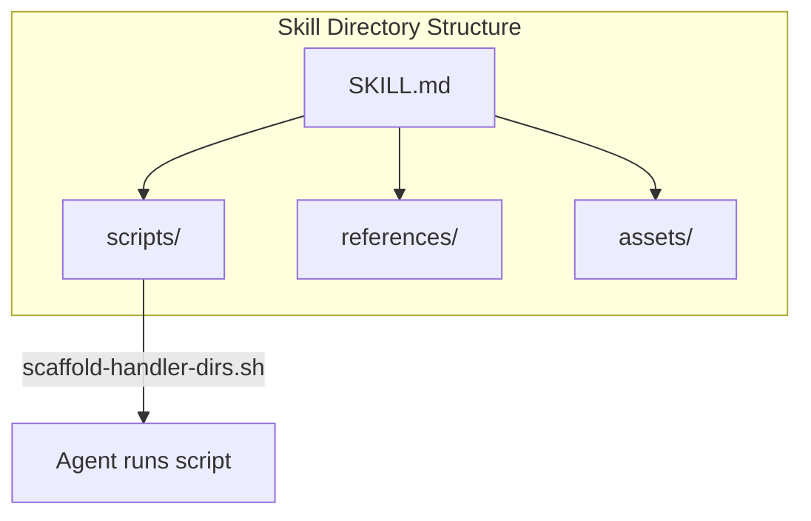
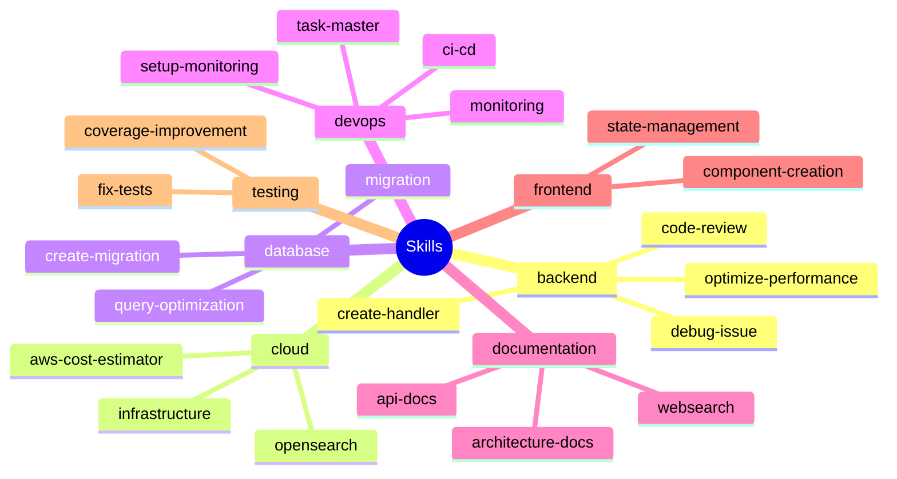

# Skills

Skills are step-by-step workflows defined in `.cursor/skills/` as `SKILL.md` files. They guide the AI through multi-step tasks (e.g. create handler, run code review, create migration, fix tests).

## Scripts folder support (Cursor 2.4+)

Cursor supports a `scripts/` directory inside each skill. The agent can run these scripts as part of the workflow:



```
.cursor/skills/backend/create-handler/
├── SKILL.md
├── scripts/
│   └── scaffold-handler-dirs.sh
├── references/
└── assets/
```

Reference scripts in `SKILL.md` using relative paths (e.g. `scripts/scaffold-handler-dirs.sh`). See [Cursor Skills docs](https://cursor.com/docs/skills) and the `create-handler` skill for a demo.

## Usage

- Skills are loaded when the user's request matches the skill's trigger (e.g. "create a new API handler").
- The AI follows the steps and checklists in the skill instead of ad-hoc behavior.

## Structure

Skills are grouped by domain:



- **backend/** — code-review, create-handler, debug-issue, optimize-performance
- **cloud/** — infrastructure, aws-cost-estimator, opensearch
- **database/** — migration, query-optimization, create-migration
- **devops/** — ci-cd, monitoring, task-master, setup-monitoring
- **documentation/** — api-docs, architecture-docs, websearch
- **frontend/** — component-creation, state-management
- **testing/** — fix-tests, coverage-improvement

Each `SKILL.md` describes the trigger, prerequisites, and ordered steps with optional code snippets.
