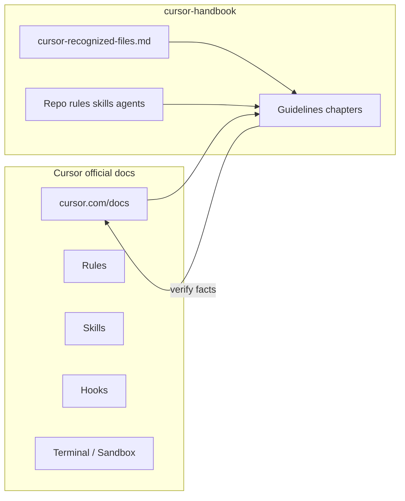

# Cursor guidelines · cursor-handbook

**cursor-handbook** ships these chapters as a **deep orientation** to **Cursor IDE** concepts (rules, skills, agents, hooks, models, sandbox, settings). They complement—**do not replace**—[Cursor’s official documentation](https://cursor.com/docs). *Cursor*, *Cursor IDE*, and related product assets are **trademarks and intellectual property of their respective owners** (e.g. Anysphere, Inc.); this handbook is **independent** and **not affiliated or endorsed**. See [Disclaimer](./chapters/00-disclaimer-and-official-docs.md).

**Start here:** [Disclaimer and official docs](./chapters/00-disclaimer-and-official-docs.md)

## How knowledge flows

## Chapters

| # | Topic | File |
|---|--------|------|
| 0 | Disclaimer, trademarks, official docs | [chapters/00-disclaimer-and-official-docs.md](./chapters/00-disclaimer-and-official-docs.md) |
| 1 | IDE settings, models, sandbox, finding rules/skills/agents | [chapters/01-ide-settings-and-models.md](./chapters/01-ide-settings-and-models.md) |
| 2 | Rules, `globs`, `alwaysApply`, `@` mentions | [chapters/02-rules.md](./chapters/02-rules.md) |
| 3 | Skills vs skill scripts vs repo `scripts/` | [chapters/03-skills-and-scripts.md](./chapters/03-skills-and-scripts.md) |
| 4 | Agents | [chapters/04-agents.md](./chapters/04-agents.md) |
| 5 | Commands | [chapters/05-commands.md](./chapters/05-commands.md) |
| 6 | Hooks, `hooks.json`, events | [chapters/06-hooks.md](./chapters/06-hooks.md) |
| 7 | Token efficiency | [chapters/07-token-efficiency.md](./chapters/07-token-efficiency.md) |
| 8 | Prompt writing | [chapters/08-prompt-writing.md](./chapters/08-prompt-writing.md) |
| 9 | Security and PII | [chapters/09-security-and-pii.md](./chapters/09-security-and-pii.md) |
| 10 | `.cursor` folder structure, monorepos | [chapters/10-folder-structure.md](./chapters/10-folder-structure.md) |
| 11 | Team collaboration | [chapters/11-team-collaboration.md](./chapters/11-team-collaboration.md) |
| 12 | Comparisons + **migration** (VS Code, IntelliJ) | [chapters/12-comparisons.md](./chapters/12-comparisons.md) |
| 13 | MCP servers | [chapters/13-mcp.md](./chapters/13-mcp.md) |
| 14 | What can go wrong | [chapters/14-what-can-go-wrong.md](./chapters/14-what-can-go-wrong.md) |
| 15 | Helpful rules, skills, agents | [chapters/15-helpful-rules-skills-agents.md](./chapters/15-helpful-rules-skills-agents.md) |
| 16 | Workflow examples | [chapters/16-workflow-examples.md](./chapters/16-workflow-examples.md) |

## Canonical vocabulary (quick lookup)

| Cursor term | Meaning | Detail |
|-------------|---------|--------|
| `alwaysApply` | Rule YAML: always inject rule into Agent chat context | [Rules](https://cursor.com/docs/rules), [ch. 2](./chapters/02-rules.md) |
| `globs` | Rule YAML: path patterns; rule applies when matching files in context | [ch. 2](./chapters/02-rules.md) |
| `description` | Rule/skill/agent: human + Agent-readable “when this applies” | [cursor-recognized-files](../reference/cursor-recognized-files.md) |
| Project rules | Files under `.cursor/rules/` | [Rules](https://cursor.com/docs/rules) |
| User rules | Global in Cursor Settings | [Rules](https://cursor.com/docs/rules) |
| Team rules | Org-wide from dashboard | [Team Rules](https://cursor.com/docs/rules#team-rules) |
| `hooks.json` | Wires hook scripts to Agent events | [Hooks](https://cursor.com/docs/agent/hooks), [ch. 6](./chapters/06-hooks.md) |
| Sandbox | Restricted environment for Agent terminal commands | [Terminal](https://cursor.com/docs/agent/terminal), [sandbox ref](https://cursor.com/docs/reference/sandbox) |

Full keyword tables: [Cursor-recognized files](../reference/cursor-recognized-files.md).

## On the web

The [handbook website](https://girijashankarj.github.io/cursor-handbook/#guide) **Guidelines** view renders these chapters with search and TOC.
