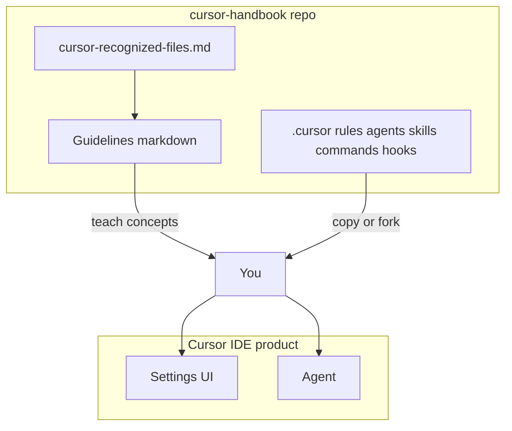

# Disclaimer and official documentation

> **cursor-handbook · Cursor guidelines** — Independent learning material. *Cursor* and related names are **Cursor / Anysphere rights**; we use them descriptively only.

## Independent handbook

**cursor-handbook** (this repository) and the **Cursor guidelines** chapters are **community-maintained**. They are **not** affiliated with, endorsed by, or sponsored by **Cursor** or **Anysphere Inc.**

## Trademarks and product rights

**Cursor**, **Cursor IDE**, logos, UI design, and **official documentation** are **intellectual property of their respective owners**. This handbook does not claim any rights over Cursor products. All rights remain with the respective owners.

## Where official answers live

Authoritative behavior, UI labels, and feature flags change with Cursor releases. Always verify against:

| Topic | Official URL |
|-------|----------------|
| Hub | [cursor.com/docs](https://cursor.com/docs) |
| **Rules** (project / user / team, `globs`, `alwaysApply`) | [cursor.com/docs/rules](https://cursor.com/docs/rules) |
| Agent Skills | [cursor.com/docs/skills](https://cursor.com/docs/skills) |
| Hooks | [cursor.com/docs/agent/hooks](https://cursor.com/docs/agent/hooks) |
| Agent terminal + sandbox | [cursor.com/docs/agent/terminal](https://cursor.com/docs/agent/terminal) |
| `sandbox.json` reference | [cursor.com/docs/reference/sandbox](https://cursor.com/docs/reference/sandbox) |
| Plugins (agents, commands) | [cursor.com/docs/reference/plugins](https://cursor.com/docs/reference/plugins) |
| BugBot | [cursor.com/docs/bugbot](https://cursor.com/docs/bugbot) |

## How this guide relates to cursor-handbook

- **Guidelines** explain **what Cursor recognizes** and **how to configure** it.
- **cursor-handbook** `.cursor/` tree is an **example rules engine** with `{{CONFIG}}` placeholders—not a Cursor product.

## How to use this guide

1. Read **vocabulary** in [README](../README.md#canonical-vocabulary-quick-lookup) and [chapter 2](./02-rules.md).
2. Use **Settings** guidance in [chapter 1](./01-ide-settings-and-models.md) to find rules, skills, agents, models, and sandbox options in the app.
3. Cross-check every **behavioral claim** on [cursor.com/docs](https://cursor.com/docs).

---

**Official resources**

- [cursor.com/docs](https://cursor.com/docs)
- [Rules](https://cursor.com/docs/rules)

**In this repo**

- [Cursor-recognized files](../../reference/cursor-recognized-files.md)
- [Non-technical getting started](../../getting-started/non-technical.md)
