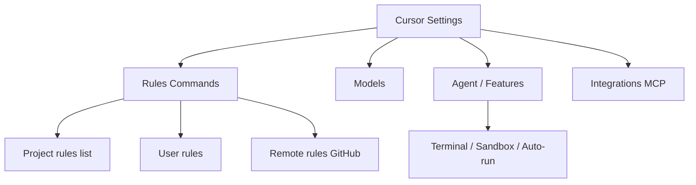
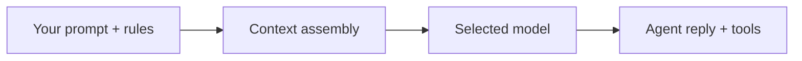

# Cursor IDE settings, models, sandbox, and finding your config

> **cursor-handbook · Cursor guidelines** — *Cursor* UI and features are **Cursor’s product**; menu names can change. Use **Settings search** and official docs to confirm.

## Settings map (mental model)

Open **Cursor Settings** (OS-specific shortcut; use Command Palette → “Cursor Settings” if unsure). Use the **search box at the top** of Settings—this is the fastest way as Cursor adds panels over time.

## Finding project rules, user rules, and remote rules

| What | Where to look in Settings | Official |
|------|---------------------------|----------|
| **Project rules** | Search **“rules”** → area that lists `.cursor/rules` files, toggles, or “Project Rules” | [Rules](https://cursor.com/docs/rules) |
| **User rules** | Same family of settings; **global** to your Cursor profile | [User Rules](https://cursor.com/docs/rules) |
| **Remote rules (GitHub)** | Add rule from GitHub URL; stays synced | [Importing rules](https://cursor.com/docs/rules#importing-rules) |

In the **editor**, rules often appear as managed files under `.cursor/rules/`. The Settings UI and the filesystem **should agree**; if a rule is disabled in UI, it may not apply even if the file exists.

## Finding skills and agents

| What | Typical discovery path |
|------|-------------------------|
| **Skills** | Settings → search **“skills”** (or “Agent Skills”). You may add skills from disk (`~/.cursor/skills`, project `.cursor/skills`) or from GitHub per your Cursor version. | [Agent Skills](https://cursor.com/docs/skills) |
| **Agents** | Settings → search **“agents”** or **“plugins”**. Custom agents are usually backed by `.cursor/agents/*.md`. | [Plugins](https://cursor.com/docs/reference/plugins) |

**cursor-handbook** ships many example skills and agents so you can **see working frontmatter** in this repo’s `.cursor/` folder.

## Models (which “brain” the Agent uses)

- **Default model** for chat/Agent is plan-dependent; pick in **Models** (or equivalent) in Settings.
- **Usage and limits** are tied to your account—see [dashboard](https://cursor.com/dashboard) and official [usage / pricing](https://cursor.com/docs) help topics.

Rules, skills, and `@file` references all affect **input context size** → token usage. See [Token efficiency](./07-token-efficiency.md).

## Agent terminal, sandbox, and auto-run

Cursor can run shell commands on your behalf from the **Agent**. Newer versions emphasize a **sandbox** so commands have **restricted filesystem and network** access by default.

| Topic | Read this first |
|-------|-------------------|
| Terminal behavior, sandbox overview | [Agent Terminal](https://cursor.com/docs/agent/terminal) |
| `sandbox.json` knobs (paths, network, etc.) | [Sandbox reference](https://cursor.com/docs/reference/sandbox) |

**Practical checklist**

1. Read **Terminal** doc above—note OS differences (e.g. Windows/WSL) if applicable.
2. In **Settings**, search **“sandbox”**, **“terminal”**, or **“auto run”** to find **how commands are approved** (e.g. run in sandbox vs ask every time).
3. For repo-specific exceptions, consider **per-project** sandbox config only as documented (see **Sandbox reference**).

**Security:** Sandbox reduces blast radius; it is **not** a substitute for code review, secrets hygiene, or least-privilege credentials.

## Team and enterprise

**Team Rules** are created in the **Cursor dashboard** and can be **enforced** for members. Precedence: **Team → Project → User** rules. Details: [Team Rules](https://cursor.com/docs/rules#team-rules).

## Dashboard and billing

- [cursor.com/dashboard](https://cursor.com/dashboard) — usage, team content, integrations (labels change over time).

This repo’s [Cursor usage](../../guides/cursor-usage.md) collects common links; **verify** against current Cursor pages.

---

**Official resources**

- [Cursor docs](https://cursor.com/docs)
- [Rules](https://cursor.com/docs/rules)
- [Agent Terminal](https://cursor.com/docs/agent/terminal)
- [Sandbox reference](https://cursor.com/docs/reference/sandbox)
- [Team Rules](https://cursor.com/docs/rules#team-rules)

**In this repo**

- [Cursor usage](../../guides/cursor-usage.md)
- [Token efficiency](./07-token-efficiency.md)
- [Cursor-recognized files](../../reference/cursor-recognized-files.md)
