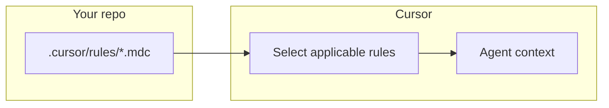

# Cursor rules: vocabulary, frontmatter, and UI mapping

> **cursor-handbook · Cursor guidelines** — Rule **semantics** are defined by Cursor. Full truth: [cursor.com/docs/rules](https://cursor.com/docs/rules).

## What project rules do

**Project rules** are markdown (`.md` / `.mdc`) under `.cursor/rules/`. When Cursor applies a rule, its text is included in the **Agent’s context** so the model behaves consistently. Official overview: [Rules — How rules work](https://cursor.com/docs/rules).



## Recognized YAML keywords (project rules)

These are the **stable vocabulary** Cursor uses in rule frontmatter (see also [Cursor-recognized files](../../reference/cursor-recognized-files.md)):

| Keyword | Type | Role |
|---------|------|------|
| `description` | string | When `alwaysApply` is false: helps the Agent **decide** if the rule is relevant. Write like a short product requirement: *when* this rule should fire. |
| `alwaysApply` | boolean | `true` → rule is included in **every** Agent chat for this project (strong signal; use sparingly). `false` or omitted → conditional application. |
| `globs` | string or array | Path patterns (e.g. `src/**/*.ts,src/**/*.tsx`). Rule applies when files matching these patterns are **in context**. Comma-separated string is common. |

### UI type ↔ frontmatter (mental map)

Cursor’s rule **type dropdown** in Settings corresponds to these ideas (wording may vary by version):

| Cursor UI label (typical) | Frontmatter pattern |
|---------------------------|---------------------|
| **Always Apply** | `alwaysApply: true` |
| **Apply Intelligently** | `alwaysApply: false` + strong `description` |
| **Apply to Specific Files** | `globs: "..."` (often with `alwaysApply: false`) |
| **Apply Manually** | Minimal frontmatter; invoke with **`@rule`** in chat |

Official table: [Rule anatomy](https://cursor.com/docs/rules).

### Example (scoped backend rule)

```markdown
---
description: "REST handler patterns and validation for API code"
alwaysApply: false
globs: src/api/**/*.ts,src/api/**/*.tsx
---

- Validate inputs at the boundary
- Return typed errors with stable codes
```

## `@` mentions and file references

- **`@some-rule`** — pull a **manual** rule into context (when supported).
- **`@path/to/file.ts`** — attach file content per Cursor’s context rules.

Exact `@` behavior is product-defined; see [Rules FAQ](https://cursor.com/docs/rules) and in-app help.

## Other rule *channels* (same mental model, different file)

| Mechanism | Location | Frontmatter? |
|-----------|----------|----------------|
| **AGENTS.md** | Repo root or subdirs | No — plain markdown |
| **User rules** | Cursor Settings | No files in repo |
| **Team rules** | Dashboard | Org-managed |
| **Remote rules** | GitHub URL in Settings | Synced from remote repo |

Precedence when conflicts arise: **Team → Project → User** (official: [Team Rules](https://cursor.com/docs/rules#team-rules)).

## Legacy `.cursorrules`

Root **`.cursorrules`** is **legacy** but still supported. Prefer `.cursor/rules/*.mdc` for structure and `globs`. Official note: [Rules](https://cursor.com/docs/rules).

## Best practices (official, summarized)

From [Rules — Best practices](https://cursor.com/docs/rules):

- Keep each rule **focused**; split large topics.
- Stay roughly **under ~500 lines** per rule (Cursor guidance).
- **Reference** files with `@` instead of pasting huge blobs.
- Don’t duplicate **linters** or generic tool docs—point to your config instead.

## cursor-handbook example rules

This repo uses:

- **`alwaysApply: true`** for global guardrails (security, token efficiency, main rules).
- **`alwaysApply: false` + `globs`** for backend, frontend, database, etc.

See table “Keywords in Use” in [cursor-recognized-files.md](../../reference/cursor-recognized-files.md).

---

**Official resources**

- [Rules](https://cursor.com/docs/rules) — primary reference
- [AGENTS.md](https://cursor.com/docs/rules#agentsmd)
- [Team Rules](https://cursor.com/docs/rules#team-rules)

**In this repo**

- [Cursor-recognized files](../../reference/cursor-recognized-files.md)
- [Rules component doc](../../components/rules.md)
- `.cursor/rules/` — examples with `{{CONFIG.*}}` placeholders
