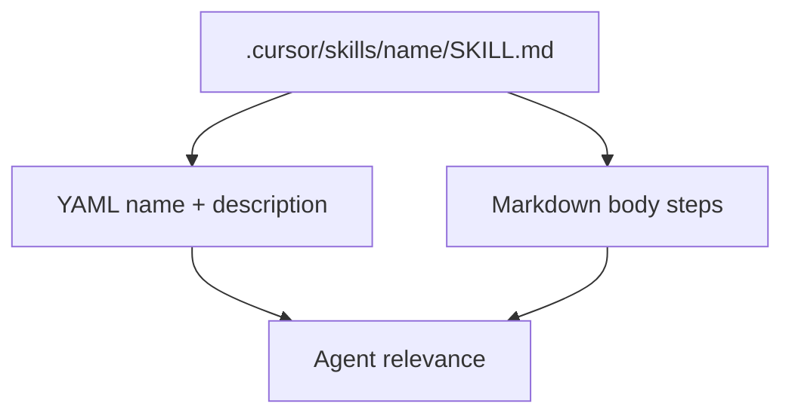

# Cursor skills, `SKILL.md` keywords, and scripts

> **cursor-handbook · Cursor guidelines** — Skill schema is defined by Cursor: [Agent Skills](https://cursor.com/docs/skills).

## What a skill is

A **skill** is a folder (e.g. `.cursor/skills/my-skill/`) whose entry point is **`SKILL.md`**. The Agent uses the skill’s **`description`** (and your prompt) to decide when to follow that workflow.

## `SKILL.md` frontmatter vocabulary

| Keyword | Required | Meaning |
|---------|----------|---------|
| `name` | **Yes** | Identifier: lowercase, numbers, hyphens; **must match parent folder name**. |
| `description` | **Yes** | What the skill does and **when** to use it—Agent uses this for matching. |
| `license` | No | License string or reference. |
| `compatibility` | No | Environment notes (packages, network, OS). |
| `metadata` | No | Arbitrary key/value for tooling. |
| `disable-model-invocation` | No | If `true`, skill runs only when user invokes explicitly (e.g. slash), not auto-selected by the Agent. |

Full table: [Cursor-recognized files — Skill keywords](../../reference/cursor-recognized-files.md).

## Optional skill layout: `scripts/`, `references/`, `assets/`

Cursor’s skill layout may include:

- **`scripts/`** — helper scripts **for that skill** only  
- **`references/`** — extra markdown the skill can lean on  
- **`assets/`** — templates, fixtures  

Do **not** confuse with **`scripts/` at repository root** (normal project tooling).

## Load paths (where Cursor looks)

Besides `.cursor/skills/`, Cursor may load from compatibility paths, e.g.:

- `.claude/skills/`, `~/.claude/skills/`
- `.codex/skills/`, `~/.codex/skills/`

See [Cursor-recognized files](../../reference/cursor-recognized-files.md).

## Three “script” meanings (common confusion)

| Path | What it is |
|------|------------|
| `.cursor/skills/<skill>/scripts/` | Optional **skill-attached** scripts (Cursor skill layout) |
| `.cursor/hooks/*.sh` + **`hooks.json`** | **Agent lifecycle** automation |
| `scripts/` at **repo root** | **Project** scripts (CI, codegen)—**not** a Cursor spec |

**cursor-handbook** root [`scripts/`](../../../scripts) = generators and validation for **this repo**, not Cursor skills.

## Skills vs hooks

| | Skills | Hooks |
|---|--------|--------|
| **Purpose** | Teach a **workflow** | Run **commands** on events |
| **Config** | `SKILL.md` | `.cursor/hooks.json` |
| **Doc** | [Skills](https://cursor.com/docs/skills) | [Hooks](https://cursor.com/docs/agent/hooks) |

---

**Official resources**

- [Agent Skills](https://cursor.com/docs/skills)
- [Hooks](https://cursor.com/docs/agent/hooks)

**In this repo**

- [Skills component doc](../../components/skills.md)
- `.cursor/skills/` — examples
