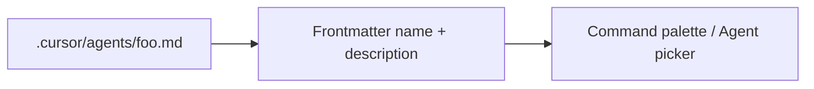

# Cursor agents: discovery, frontmatter, flat layout

> **cursor-handbook · Cursor guidelines** — Custom agents are part of Cursor’s **plugins** surface. Official: [Plugins reference](https://cursor.com/docs/reference/plugins).

## What custom agents are

**Agents** are markdown definitions that specialize the Assistant (e.g. security review, migrations, docs). You invoke them via the product’s UI (often **slash commands** like `/code-reviewer`—exact list depends on your project files and Cursor version).



## Agent file frontmatter

Per [Plugins reference](https://cursor.com/docs/reference/plugins), command/agent markdown commonly uses:

```yaml
---
name: my-agent-slug
description: One line: what it does and when to use it
---
```

- **`name`** — stable id; often drives `/name` style invocation.
- **`description`** — shown in UI and used for discovery.

Match patterns in this repo’s `.cursor/agents/*.md` files.

## Critical layout rule: **flat** `.cursor/agents/`

Cursor discovers **custom agents** as files directly under:

```text
.cursor/agents/*.md
```

**Subfolders are not supported** for agent discovery—do not put agents in `.cursor/agents/backend/foo.md` if you expect Cursor to index them. This is documented in [Cursor-recognized files](../../reference/cursor-recognized-files.md).

**Naming convention (cursor-handbook):** `{domain}-{role}-agent.md` (e.g. `backend-code-reviewer.md`) so 30+ agents stay sortable.

## Agents vs skills vs rules

| | Rules | Skills | Agents |
|---|-------|--------|--------|
| **Goal** | Always/conditionally **inject policy** | **Procedure** / checklist | **Persona** / deep task |
| **Files** | `.cursor/rules/**` | `.cursor/skills/**/SKILL.md` | `.cursor/agents/*.md` |
| **Subfolders** | Yes | Yes (per skill folder) | **No** (agents flat) |

## Checking agents in Settings

Search Settings for **“agents”** or **“plugins”** to see enabled project agents and any global options. If an agent file exists but does not appear, verify **path** (flat), **frontmatter**, and Cursor version.

---

**Official resources**

- [Plugins reference](https://cursor.com/docs/reference/plugins)

**In this repo**

- [Agents component doc](../../components/agents.md)
- `.cursor/agents/` — 34 example agents
