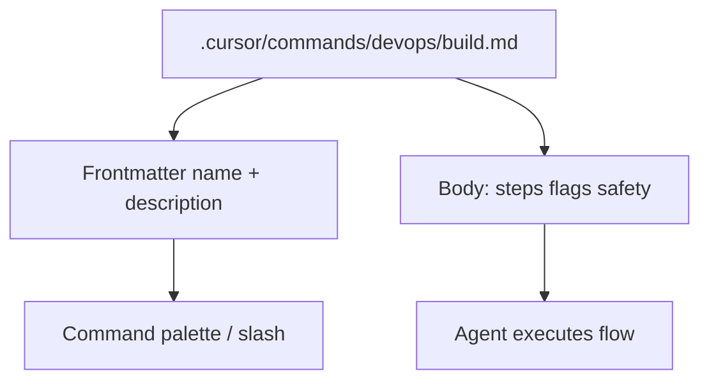

# Cursor commands: slash tasks and frontmatter

> **cursor-handbook · Cursor guidelines** — Commands are Cursor **plugin** surfaces. Official: [Plugins reference](https://cursor.com/docs/reference/plugins).

## What commands are

**Commands** are markdown files under `.cursor/commands/` (often grouped in subfolders). They tell the Agent **what to run**, **when**, and **what to expect**—so you do not re-type the same instructions.



## Frontmatter vocabulary

```yaml
---
name: type-check
description: Run TypeScript type-check without full tests
---
```

| Field | Role |
|-------|------|
| `name` | Usually becomes **`/name`** style invocation (e.g. `/type-check`). |
| `description` | Shown in UI; helps you and the Agent pick the right command. |

## How commands differ from skills

| | Command | Skill |
|---|---------|-------|
| **Shape** | Single `.md` file | Folder + `SKILL.md` |
| **Typical use** | One-shot **shell / task** recipe | **Multi-step** guided workflow |
| **Doc** | [Plugins](https://cursor.com/docs/reference/plugins) | [Skills](https://cursor.com/docs/skills) |

## Organizing commands (cursor-handbook pattern)

- `backend/` — type-check, lint, format  
- `testing/` — single-file tests, coverage  
- `devops/` — build, deploy, commit message, PR description  
- `security/` — audit, secrets, dependency fixes  

Use [`COMMAND_TEMPLATE.md`](../../../.cursor/commands/COMMAND_TEMPLATE.md) when adding new ones.

## Finding commands in the product

- **Command Palette** (search command name).  
- **Agent chat**: type **`/`** to see slash commands (Cursor version dependent).  
- Settings → search **“commands”** if your build exposes a list.

---

**Official resources**

- [Plugins reference](https://cursor.com/docs/reference/plugins)

**In this repo**

- [Commands component doc](../../components/commands.md)
- `.cursor/commands/`
