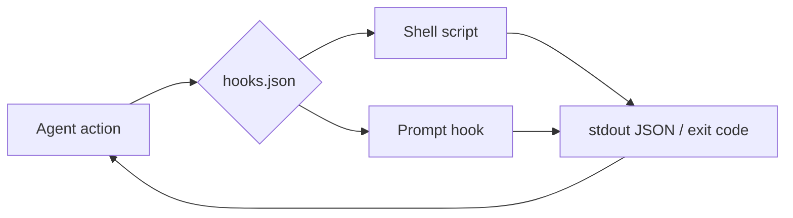

# Cursor hooks: `hooks.json`, events, matchers, sandbox

> **cursor-handbook · Cursor guidelines** — Hook **event names** and JSON shape are product-defined. Canonical: [Hooks](https://cursor.com/docs/agent/hooks). This chapter mirrors [cursor-recognized-files](../../reference/cursor-recognized-files.md) with extra **settings** context.

## What hooks do

**Hooks** run **commands** or **prompt-based checks** when the **Agent** hits lifecycle points—e.g. before sending a prompt, after editing a file, before running shell.



## Where hooks are configured

| Scope | File |
|-------|------|
| **Project** | `.cursor/hooks.json` at repo root |
| **User** | `~/.cursor/hooks.json` |

**Not** the same as Editor “tasks.json”—hooks are **Agent-pipeline** integration.

## Minimal `hooks.json` shape

```json
{
  "version": 1,
  "hooks": {
    "beforeSubmitPrompt": [{ "command": ".cursor/hooks/context-enrichment.sh" }],
    "afterFileEdit": [{ "command": ".cursor/hooks/auto-format.sh" }],
    "beforeShellExecution": [{ "command": ".cursor/hooks/shell-guard.sh" }]
  }
}
```

Each event maps to an **array** of hook objects—multiple hooks can run in order.

## Agent hook event names (vocabulary)

Use this table when reading or writing `hooks.json` (names must match Cursor exactly):

| Event | Typical use |
|-------|-------------|
| `sessionStart` / `sessionEnd` | Session lifecycle |
| `beforeSubmitPrompt` | Inject or trim prompt context |
| `afterAgentResponse` / `afterAgentThought` | Post-process responses |
| `beforeReadFile` / `afterFileEdit` | Enforce format, lint, policy on reads/edits |
| `beforeShellExecution` / `afterShellExecution` | Block dangerous commands, audit |
| `beforeMCPExecution` / `afterMCPExecution` | Gate MCP tool calls |
| `subagentStart` / `subagentStop` | Subagent lifecycle |
| `preToolUse` / `postToolUse` / `postToolUseFailure` | Generic tool wrap |
| `preCompact` / `stop` | Compaction / stop |

**Tab** (inline completion) hooks are separate: e.g. `beforeTabFileRead`, `afterTabFileEdit`.

## Hook object fields

| Field | Meaning |
|-------|---------|
| `command` | Path to executable/script (often relative to project root) |
| `timeout` | Seconds |
| `matcher` | Regex filter (e.g. which shell commands fire the hook) |
| `type` | `"prompt"` for LLM-evaluated guard instead of a script |
| `prompt` | Natural-language condition when `type: "prompt"` |

### Prompt-based hook (no script)

```json
{
  "beforeShellExecution": [
    {
      "type": "prompt",
      "prompt": "Allow only read-only or workspace-local commands.",
      "timeout": 10
    }
  ]
}
```

## Exit codes (shell hooks)

| Code | Meaning |
|------|---------|
| `0` | Success; stdout may be JSON for Cursor to consume |
| `2` | **Block** the action |
| Other | Failure; Cursor may **fail-open** (allow action)—confirm in current Hooks doc |

## Hooks vs Agent sandbox

- **Sandbox** (see [Terminal](https://cursor.com/docs/agent/terminal), [Sandbox reference](https://cursor.com/docs/reference/sandbox)) restricts **what commands can do** at runtime.  
- **Hooks** let you **observe, enrich, or veto** actions in the Agent loop.  
Use **both** for defense in depth.

## Checking hooks in Settings

Search Settings for **“hooks”** if your Cursor version exposes UI for user-level hooks. **Project** hooks remain **`hooks.json` + scripts** in the repo—review in PRs like application code.

## Safety

Hooks run with your user permissions unless constrained elsewhere. **Never** commit secrets; **log** minimally; test hooks on a branch.

---

**Official resources**

- [Hooks](https://cursor.com/docs/agent/hooks)
- [Agent Terminal](https://cursor.com/docs/agent/terminal)
- [Sandbox reference](https://cursor.com/docs/reference/sandbox)

**In this repo**

- [Hooks component doc](../../components/hooks.md)
- `.cursor/hooks.json`, `.cursor/hooks/*.sh`
