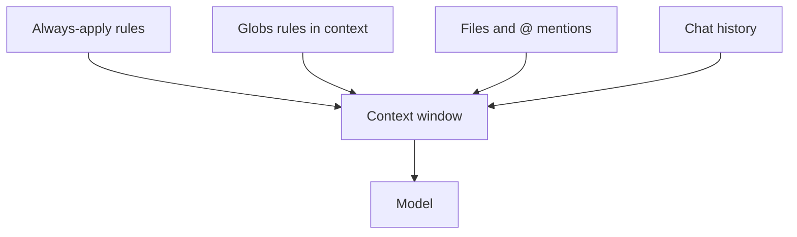

# Token efficiency and context budget

> **cursor-handbook · Cursor guidelines** — Token accounting is a **Cursor product** concern; see dashboard and official help. This chapter aligns with **cursor-handbook** rules.

## What “tokens” mean here

Each Agent turn **sends context** (rules, files, history) to a **model** and receives a reply. **Input + output** tokens drive **cost** and **latency**. Cursor shows usage in the [dashboard](https://cursor.com/dashboard); exact fields change over time.

## What inflates tokens fast

| Source | Effect |
|--------|--------|
| Many **`alwaysApply: true`** rules | Every chat pays full text |
| Huge pasted logs | Burns input tokens |
| “Read entire repo” requests | Massive file reads |
| Long chat threads | History grows |

**Mitigation:** prefer **`globs` + `description`**, attach **only needed files**, start **new chat** for new topics, use **commands** that scope work (`/test-single`, `/type-check` patterns).

## cursor-handbook defaults

This repo’s rules push:

- **No** auto full test suite / full lint in Agent without confirmation  
- Prefer **type-check** and **read_lints**-style feedback when possible  

See `.cursor/rules/architecture/token-efficiency.mdc` and [Token efficiency guide](../../guides/ai-adoption/token-efficiency.md).

## Models and “how much fits”

Different **models** have different **context limits** and **pricing**. Pick in **Cursor Settings → Models** (or equivalent). Official help: search [cursor.com/docs](https://cursor.com/docs) for models and usage.

---

**Official resources**

- [Cursor dashboard](https://cursor.com/dashboard)
- [cursor.com/docs](https://cursor.com/docs) — usage / models topics

**In this repo**

- [Token efficiency guide](../../guides/ai-adoption/token-efficiency.md)
- [Cursor usage](../../guides/cursor-usage.md)
- `.cursor/rules/architecture/token-efficiency.mdc`
