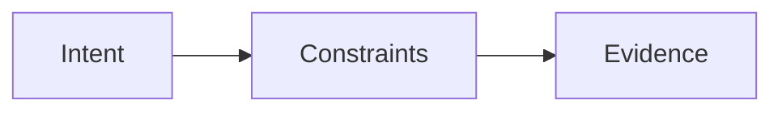

# Prompt writing for Cursor Agent

> **cursor-handbook · Cursor guidelines** — Good prompts **compose** with **rules**, **skills**, and **commands** so you do not repeat yourself.

## The ICE pattern (cursor-handbook teaching aid)

| Letter | Ask yourself |
|--------|----------------|
| **I**ntent | What artifact? (patch, test, doc, plan) |
| **C**onstraints | What must **not** change? (public API, deps, paths) |
| **E**vidence | What file/`@path`, error log, or ticket backs this? |

## Use Cursor primitives in the prompt

| Say this | Why |
|----------|-----|
| “Follow `@.cursor/rules/backend/handler-patterns.mdc`” | Pulls **policy** explicitly |
| “Use the **create-handler** skill” | Triggers **workflow** |
| “Run **`/type-check`** then fix” | Uses **command** recipe |
| “Only touch `src/orders/**`” | Narrows **globs** alignment |

## Context hygiene

- **@** the smallest file set that proves the bug.  
- For large features: ask for a **plan** first, then **stepwise** implementation.  
- If the Agent drifts: “**Revert unrelated edits**; stay inside X.”

## What User Rules are for

**User rules** (Settings) are ideal for **style**: concise replies, citation format, “always propose tests.” They apply **across projects**. See [User Rules](https://cursor.com/docs/rules).

---

**Official resources**

- [Rules](https://cursor.com/docs/rules) — persistent context reduces repeat prompting

**In this repo**

- [Best practices](../../guides/best-practices.md)
- [Workflows](../../guides/ai-adoption/workflows.md)
