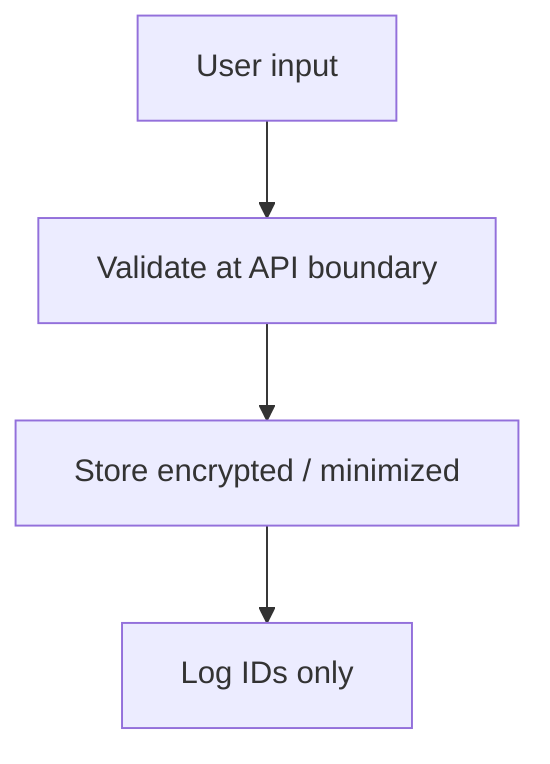

# Security, PII, and Cursor guardrails

> **cursor-handbook · Cursor guidelines** — **Cursor** does not make your code compliant by itself. Rules are **prompts**, not enforcement engines.

## Secrets and chat

| Don’t | Do |
|-------|-----|
| Paste API keys, JWTs, PEM blocks into Agent | Use env vars + secret managers |
| Commit `.env` | Use `.env.example` with placeholders |
| Log full `req.body` / headers | Log correlation IDs + safe metadata |

## PII guardrails (operational)

- **PII** includes names, emails, phones, government IDs, payment data, often **IP** in regulated contexts.  
- In **logs**, prefer `userId`, `correlationId`.  
- In **prompts**, redact or synthesize fixtures.

## How project rules help

Rules can **instruct** the Agent: “never hardcode secrets,” “mask PII,” “use parameterized queries.” They **do not** replace SAST, DAST, IAM, or review.

**cursor-handbook** ships security rules under `.cursor/rules/security/` (e.g. `guardrails.mdc`, `secrets-rules.mdc`).

## Hooks and sandbox

- **Hooks** (`beforeShellExecution`, `scan-secrets` patterns) can **block** risky commands.  
- **Sandbox** limits filesystem/network for Agent terminal—see [Terminal](https://cursor.com/docs/agent/terminal).  
Neither replaces **secrets rotation** or **least privilege**.

## Dependency and supply chain

Use `/audit-deps`, `/fix-vulnerable-deps`, and CI—see commands in this repo.

---

**Official resources**

- [cursor.com/docs](https://cursor.com/docs)

**In this repo**

- [Security guide](../../security/security-guide.md)
- `.cursor/rules/security/*.mdc`
- `/check-secrets`, `/audit-deps`, `/fix-vulnerable-deps`
