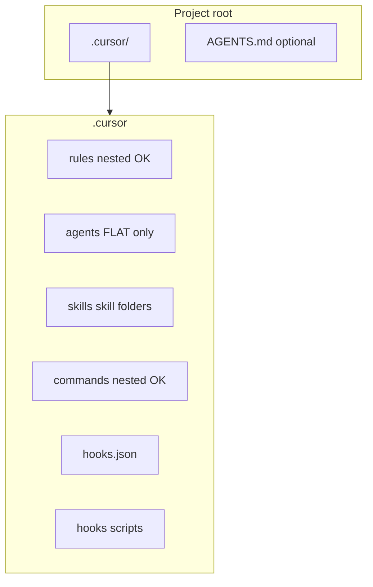
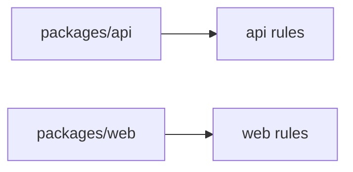

# `.cursor` layout, monorepos, and multiple trees

> **cursor-handbook · Cursor guidelines** — On-disk layout must match **what Cursor indexes**. See [Cursor-recognized files](../../reference/cursor-recognized-files.md).

## Single-repo layout (reference)



```
.cursor/
├── rules/              # .md / .mdc — subfolders OK
├── agents/             # *.md — NO subfolders for discovery
├── skills/<name>/      # SKILL.md + optional scripts/ references/ assets/
├── commands/           # .md — subfolders OK (organizational)
├── hooks.json
├── hooks/*.sh
├── BUGBOT.md           # optional
├── config/             # cursor-handbook: project.json
├── templates/
└── settings/
```

## Monorepo: rules with `globs`

Use **`globs`** so `packages/api/**` and `packages/web/**` get different rules:

```yaml
---
description: "API handlers"
alwaysApply: false
globs: packages/api/**/*.ts
---
```



## Nested `AGENTS.md`

Per [AGENTS.md nesting](https://cursor.com/docs/rules#agentsmd), place `frontend/AGENTS.md`, `backend/AGENTS.md`, etc. **More specific paths override** broader parent instructions.

## Multiple clones / forks

Teams often maintain **one fork** of **cursor-handbook** with customized `project.json`, then copy `.cursor/` into product repos. Keep **secrets** out of forked rules.

## cursor-handbook-only paths

| Path | Meaning |
|------|---------|
| `.cursor/config/project.json` | `{{CONFIG.*}}` centralization—**handbook convention**, not Cursor core |

---

**Official resources**

- [Rules](https://cursor.com/docs/rules)
- [Skills](https://cursor.com/docs/skills)
- [Hooks](https://cursor.com/docs/agent/hooks)

**In this repo**

- [Cursor-recognized files](../../reference/cursor-recognized-files.md)
- [Architecture overview](../../../ARCHITECTURE.md)
