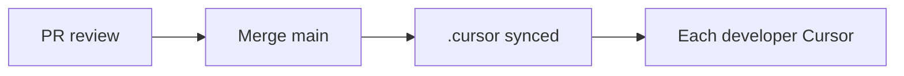

# Team collaboration with Cursor + Git

> **cursor-handbook · Cursor guidelines** — **Team Rules** are a **Cursor** product feature for orgs. Official: [Team Rules](https://cursor.com/docs/rules#team-rules).

## Git as source of truth for project config

Commit **project** rules, skills, agents, commands, hooks so every developer’s Agent behaves consistently.

## Team Rules vs project rules

| | Team rules | Project rules |
|---|------------|---------------|
| **Where** | Cursor **dashboard** | `.cursor/rules/` in git |
| **Scope** | All repos for team members | One repository |
| **Precedence** | **Wins over** project on conflict | Lower than team |

Use Team Rules for **non-negotiable** org policy; use project rules for **repo-specific** architecture.

## PR workflow

- Treat `.cursor/**` changes like **config code**: reviewer checks for **secrets**, **dangerous hooks**, and **token-heavy alwaysApply** rules.  
- Use **BugBot** / Agent review where allowed: [BugBot](https://cursor.com/docs/bugbot).

## Sharing cursor-handbook

- **Add from GitHub** in Cursor Settings for rules/skills/agents.  
- Or **fork** this repo and point your team at the fork.  
- Remote rules: [Importing rules](https://cursor.com/docs/rules#importing-rules).

---

**Official resources**

- [Team Rules](https://cursor.com/docs/rules#team-rules)
- [BugBot](https://cursor.com/docs/bugbot)
- [Importing rules](https://cursor.com/docs/rules#importing-rules)

**In this repo**

- [CONTRIBUTING.md](../../../CONTRIBUTING.md)
- [SDLC role map](../../reference/sdlc-role-map.md)
