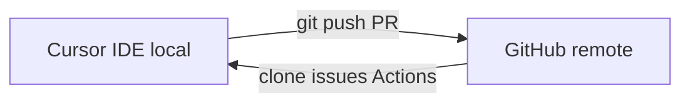
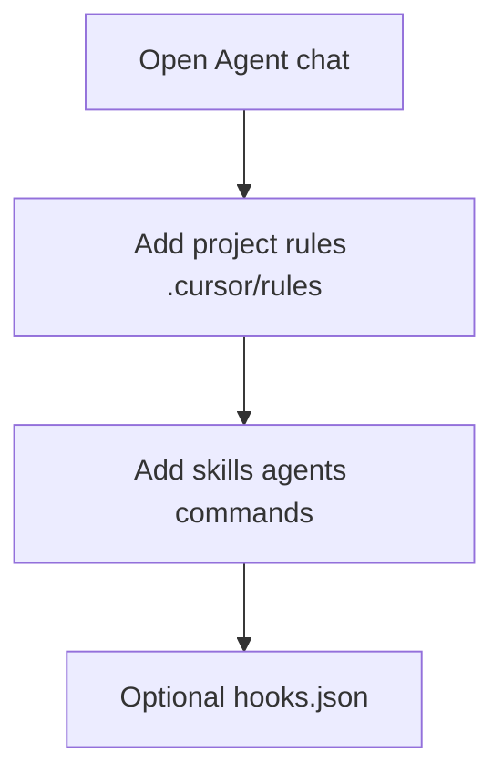

# Cursor vs GitHub, Claude, VS Code — and migrating from VS Code / IntelliJ

> **cursor-handbook · Cursor guidelines** — *Cursor* and *VS Code* are **different products**; JetBrains IDEs are a **separate ecosystem**. This chapter is **educational**, not legal comparison.

## Cursor vs GitHub (complementary)

- **GitHub**: hosting, PRs, Actions, Issues.  
- **Cursor**: editor + **Agent** + rules/skills/hooks **on your machine**.  
You still use GitHub (or GitLab, etc.) for collaboration.

## Cursor vs Claude (products)

- **Claude** (Anthropic): models + apps such as Claude Code / web.  
- **Cursor**: IDE that can use **multiple** model providers depending on account/settings.  
Compare on **editor integration**, **policy**, **pricing**, and **where code runs**—features change.

## Cursor vs VS Code (same family, different product)

Cursor is **VS Code–fork-related** for many workflows: similar layout, keybindings option, extension compatibility **often** works but is **not guaranteed**.

| Area | Expectation |
|------|-------------|
| Extensions | Test critical ones; watch for AI + debugger quirks |
| `settings.json` | Much carries over; Cursor adds **AI** settings |
| Tasks / launch | Often portable; verify paths |

---

## Migrating from Visual Studio Code to Cursor

Use this as a **checklist**; adapt to your stack.

### Phase 1 — Install and open

1. Install **Cursor** from official site (see [cursor.com](https://cursor.com)).  
2. Open the **same folder** you used in VS Code.  
3. Optional: import or sync **keybindings** / **theme** via Cursor Settings (search “keyboard”, “theme”).

### Phase 2 — Editor parity

| VS Code habit | In Cursor |
|---------------|-----------|
| Command Palette | Same muscle memory (OS-specific shortcut) |
| Extensions | Reinstall must-haves; verify language servers |
| `.vscode/` | Often still respected (`settings.json`, `extensions.json`, `launch.json`) |

### Phase 3 — Adopt Agent primitives

1. Create **`.cursor/rules/`** — start with **one** `alwaysApply` team standard + **globs** for stacks.  
2. Add **commands** for tasks you used to run manually from the terminal palette.  
3. Try **skills** for repeatable playbooks (migrations, releases).  
4. Add **hooks** only after you understand Agent terminal flow (see [Hooks](./06-hooks.md), [Terminal](https://cursor.com/docs/agent/terminal)).

### Phase 4 — Sandbox and trust

- Read [Agent Terminal](https://cursor.com/docs/agent/terminal) and [Sandbox reference](https://cursor.com/docs/reference/sandbox).  
- Set **auto-run / sandbox** preferences in Settings to match your risk tolerance.

### Phase 5 — Deprecate Copilot-only habits

If you relied on **inline-only** completion: Cursor adds **Agent**; you may keep Tab-style features where offered, but **rules + Agent** replace some “chat in sidebar” patterns from other tools.

---

## Migrating from IntelliJ IDEA / JetBrains to Cursor

JetBrains and Cursor share **some** concepts (refactor, VCS, run configs) but **not** the same project model.

### What does **not** copy 1:1

| IntelliJ | Cursor |
|----------|--------|
| `.idea/` run configurations | Use **VS Code–style** `launch.json` / tasks where applicable |
| Module / facet model | **Folder = workspace**; use rules `globs` per area |
| JetBrains AI | Different product—expect different UX |

### Migration checklist

1. **Clone/open repo** in Cursor (same git remote).  
2. Export or note **critical run/debug** steps; recreate as **npm/scripts** + `launch.json` if needed.  
3. Port **team standards** into **`.cursor/rules/`** instead of only IDE inspections (keep inspections in CI too).  
4. Use **nested `AGENTS.md`** under `backend/`, `frontend/` if you had **per-module** README conventions.  
5. Expect **keybinding** differences—search Cursor Settings or use keymap extensions if allowed.

### When to stay on JetBrains

If you depend on **deep JVM/Android tooling** that is immature in VS Code ecosystem, you may use **both IDEs**: small edits in Cursor with Agent, heavy debugging in JetBrains—**team policy permitting**.

---

**Official resources**

- [Cursor docs](https://cursor.com/docs)
- [Rules](https://cursor.com/docs/rules)
- [Agent Terminal](https://cursor.com/docs/agent/terminal)

**In this repo**

- [Claude IDE support](../../guides/claude-ide-support.md)
- [README — Cross-Tool compatibility](../../../README.md)
