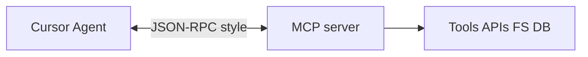

# Cursor and MCP servers

> **cursor-handbook · Cursor guidelines** — **MCP** (Model Context Protocol) lets Cursor connect to **tools** and **data**. Product details live in Cursor docs; search **MCP** on [cursor.com/docs](https://cursor.com/docs).

## Mental model

## Why MCP matters

- **Composable tools**: one server exposes many capabilities (e.g. issue tracker, internal API).  
- **Explicit trust boundary**: you choose which servers are enabled.

## Safety checklist

1. **Review** what each tool can read/write before enabling in production repos.  
2. Prefer **read-only** servers first.  
3. **Rotate** credentials; never paste secrets into chat.  
4. Pair with **hooks** (`beforeMCPExecution`) where policy requires—see [Hooks](./06-hooks.md).

## Configuration

Exact UI path changes; use **Settings search** for “MCP” and follow current Cursor instructions.

---

**Official resources**

- [cursor.com/docs](https://cursor.com/docs) — search MCP

**In this repo**

- `.cursor/rules/security/guardrails.mdc` — secret / exfil patterns to combine with MCP policy
