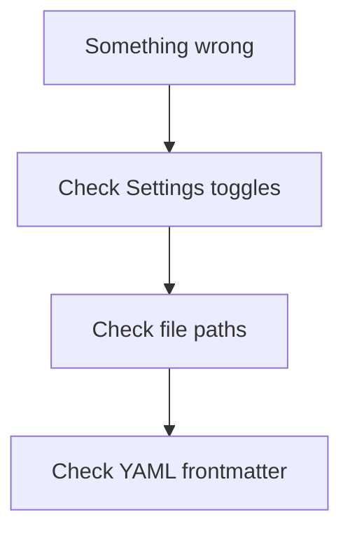

# What can go wrong (Cursor + Agent)

> **cursor-handbook · Cursor guidelines** — Most failures are **misconfiguration**, **over-trust**, or **context overload**—not “AI bugs” alone.

## Configuration mistakes

| Symptom | Likely cause |
|---------|----------------|
| Rule never applies | Wrong **`globs`**, `alwaysApply: false` + weak `description`, or disabled in Settings |
| Agent ignores skill | Bad **`description`**, or `disable-model-invocation: true` |
| Custom agent missing | File not in **`.cursor/agents/*.md`** (nested path) |
| Hook never runs | Wrong **event name** in `hooks.json`, bad path, or exit handling |

## Trust and safety failures

- Approving **destructive shell** because sandbox was misunderstood.  
- **Exfiltration** via MCP or copied webhook URLs in rules.  
- **Secrets** committed after Agent suggested a “quick test” snippet.

Mitigate: **hooks**, **sandbox**, **code review**, **secret scanning**.

## Context / token failures

- **Huge** `alwaysApply` rules → slow, expensive, confused model.  
- **Stale** pasted spec → Agent implements wrong thing.

Mitigate: split rules, use `@files`, refresh chat.

## cursor-handbook-specific

If `{{CONFIG.*}}` placeholders appear **verbatim** in output, **`project.json`** is missing or not merged—see [configuration](../../getting-started/configuration.md).

---

**Official resources**

- [Rules FAQ](https://cursor.com/docs/rules)
- [Hooks](https://cursor.com/docs/agent/hooks)

**In this repo**

- [Troubleshooting](../../getting-started/troubleshooting.md)
