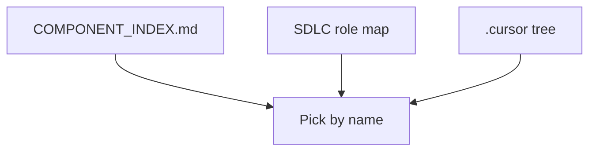

# Curated rules, skills, and agents (cursor-handbook)

> **cursor-handbook · Cursor guidelines** — This repo is a **rules engine sample**. *Cursor* is the IDE; **cursor-handbook** is the **content pack**.

## How to navigate this repo

| Start here | Use when |
|------------|----------|
| [COMPONENT_INDEX.md](../../../COMPONENT_INDEX.md) | You want a **flat list** of every rule/agent/skill/command/hook |
| [SDLC role map](../../reference/sdlc-role-map.md) | You think in **roles** (PM, QA, DevOps, Security) |
| [cursor-recognized-files](../../reference/cursor-recognized-files.md) | You need **official Cursor vocabulary** |

## Suggested starter packs (generic backend team)

| Goal | Try |
|------|-----|
| Stop token waste | `architecture/token-efficiency.mdc`, `main-rules.mdc` |
| Security baseline | `security/guardrails.mdc`, `secrets-rules.mdc`, `/check-secrets` |
| API work | `backend/handler-patterns.mdc`, skill `create-handler`, agent `backend-api-agent` |
| Tests | `testing/testing-standards.mdc`, skills `fix-tests`, `flaky-test`, `/test-single` |
| Releases | commands `/commit-message`, `/pr-description` |

## Customizing for your org

1. Copy `.cursor/` + `.cursor/config/project.json` from template.  
2. Replace **`{{CONFIG.*}}`** via `project.json` (see [configuration](../../getting-started/configuration.md)).  
3. **Delete** domains you do not use (e.g. cloud rules) to save tokens.

---

**Official resources**

- [Rules](https://cursor.com/docs/rules)
- [Skills](https://cursor.com/docs/skills)

**In this repo**

- [Component readiness](../../component-readiness.md)
- [Component overview](../../components/overview.md)
