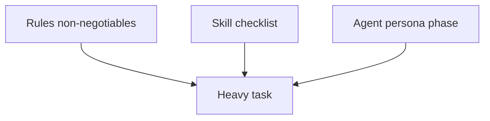

# Workflow examples: compose rules + skills + agents

> **cursor-handbook · Cursor guidelines** — Patterns for **heavy tasks**. No real secrets; validate in **staging**.

## Composition pattern (teaching aid)

| Layer | Example in cursor-handbook |
|-------|---------------------------|
| **Rules** | Security + folder patterns |
| **Skill** | `database/migration`, `devops/task-master` |
| **Agent** | `schema-agent`, `implementation-agent` |

## By artifact type

| You want | Prompt shape |
|----------|----------------|
| **CSV** / data export | “Schema: columns … Sample rows only; no PII; output path …” |
| **OpenSearch** dashboard | “Index pattern, cluster role, example query JSON; staging only” |
| **Postman collection** | “OpenAPI snippet or route list; auth = env var names only” |
| **Boilerplate** | “Use `@.cursor/templates/...` + handler rule” |
| **Shell scripts** | “POSIX sh; set -euo pipefail; no secrets” |
| **Browser extension** | “MV3 manifest; permissions minimal; no remote code” |
| **VS Code–style extension** | “Reference official VS Code extension API docs; TypeScript” |
| **Dev CLI** | “Node or Go; single binary; config via env” |

## Heavy task recipe

1. **Rule**: defines structure, security, token limits.  
2. **Skill**: orders steps (migrate DB → backfill → verify).  
3. **Agent**: executes one **phase** with narrow scope (e.g. only SQL generation).  
4. **Hooks**: optional `beforeShellExecution` guard for production hosts.

## cursor-handbook pointers

- Templates: `.cursor/templates/`  
- Task breakdown: [task-master skill](../../../.cursor/skills/devops/task-master/SKILL.md)

---

**Official resources**

- [Rules](https://cursor.com/docs/rules)
- [Skills](https://cursor.com/docs/skills)
- [Plugins](https://cursor.com/docs/reference/plugins)

**In this repo**

- `.cursor/skills/`, `.cursor/agents/`, `.cursor/rules/`
