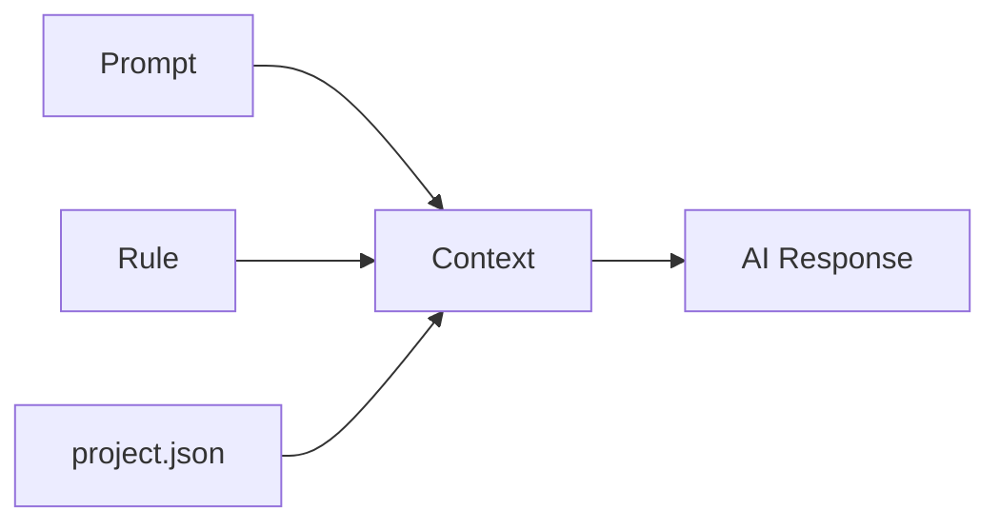

# Project Setup Guide

## project.json — Your Project Settings

All cursor-handbook components adapt to your project via `.cursor/config/project.json`.

## project.json and Centralization

**`project.json` is cursor-handbook's own convention** for centralizing project settings — it is **not** a Cursor-native feature. Cursor does not read `project.json` by default.

### How It Works

When you add a rule in Cursor chat, and that rule mentions or references `project.json` (or uses `{{CONFIG}}` placeholders that resolve from it), Cursor will read `project.json` as part of the rule's context. The effective combination is:



**Prompt + Rule + project.json**

1. **Prompt** — What the user asks
2. **Rule** — The rule file (e.g. `.cursor/rules/main-rules.mdc`) that contains `{{CONFIG.project.name}}`, `{{CONFIG.techStack.language}}`, etc.
3. **project.json** — The central config file that provides values for those placeholders

Rules that include `{{CONFIG.section.key}}` placeholders instruct the AI to use values from `project.json`. When the rule is loaded, the AI receives the rule content; if the rule references the config file, the AI can read it to resolve the placeholders. This gives you a single source of truth for project name, paths, tech stack, testing commands, and more — without duplicating config across dozens of rules.

## Schema

The configuration file follows the schema defined in `.cursor/config/project-schema.json`. Your editor will provide autocomplete and validation.

## Key Sections

### project

Basic project metadata.

```json
{
	"project": {
		"name": "my-project",
		"description": "Description of your project",
		"version": "1.0.0",
		"repository": "https://github.com/org/repo"
	}
}
```

### techStack

Your technology choices. This drives which patterns and conventions are applied.

```json
{
	"techStack": {
		"language": "TypeScript",
		"runtime": "Node.js",
		"framework": "Express.js",
		"cloud": "AWS",
		"database": "PostgreSQL",
		"testing": "Jest",
		"packageManager": "pnpm"
	}
}
```

### testing

Test configuration thresholds and commands.

```json
{
	"testing": {
		"coverageMinimum": 90,
		"testCommand": "pnpm run test",
		"typeCheckCommand": "pnpm run type-check",
		"lintCommand": "pnpm run lint",
		"coverageCommand": "pnpm run test:coverage"
	}
}
```

### paths

Project directory structure.

```json
{
	"paths": {
		"source": "src",
		"apiPath": "src/apis",
		"handlerBasePath": "src/apis/handlers/v1",
		"commonPath": "src/apis/common"
	}
}
```

### domain

Business domain configuration.

```json
{
	"domain": {
		"entities": ["Order", "Product", "Customer"],
		"lifecycles": {
			"Order": "DRAFT → SUBMITTED → PROCESSING → COMPLETED"
		}
	}
}
```

## Placeholder Syntax

Components reference configuration values using `{{CONFIG.section.key}}` syntax:

- `{{CONFIG.techStack.language}}` → "TypeScript"
- `{{CONFIG.testing.coverageMinimum}}` → 90
- `{{CONFIG.paths.apiPath}}` → "src/apis"

## Validation

Validate your configuration against the schema:

```bash
# Using ajv-cli
npx ajv validate -s .cursor/config/project-schema.json -d .cursor/config/project.json
```

## Stack Examples

See the `examples/` directory for pre-configured files for popular stacks.
