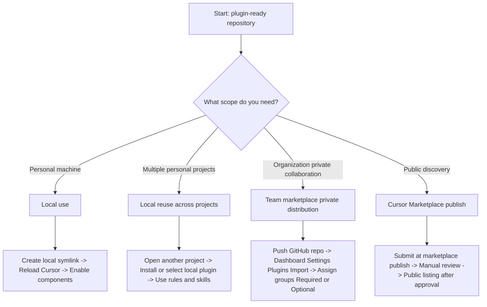

# Cursor plugins guide

This guide explains how to use `cursor-handbook` as a Cursor plugin for:

- local use on your machine
- reuse across multiple projects
- team distribution
- public marketplace publishing

## What is a Cursor plugin?

A Cursor plugin is a packaged bundle of components such as rules, skills, agents, commands, MCP servers, and hooks. In this repository, those components already exist under `.cursor/`, and the plugin manifest is defined at `.cursor-plugin/plugin.json`.

## Plugin usage paths (mermaid)



## Quick glossary

- **Plugin manifest**: `.cursor-plugin/plugin.json`, metadata for your plugin
- **Local plugin directory**: `~/.cursor/plugins/local/`
- **Team marketplace**: private team distribution of plugins
- **Cursor Marketplace**: public listing of reviewed plugins

## Prerequisites

- Cursor installed
- This repository available locally
- `.cursor-plugin/plugin.json` present (already included in this repo)

## Local setup (beginner path)

1. Create a local plugin symlink:

```bash
ln -s /absolute/path/to/cursor-handbook ~/.cursor/plugins/local/cursor-handbook
```

2. Reload Cursor:
   - Run `Developer: Reload Window`.
3. Open any project in Cursor.
4. Go to Settings and enable/use plugin components (rules/skills/agents/commands/hooks).

## Use in another project

1. Open the target project in Cursor.
2. Open plugin settings/marketplace panel.
3. Install/select `cursor-handbook` from local plugins.
4. Enable the parts you need for that project.

## Troubleshooting

### Error: `No such file or directory` for local plugin path

Cause: the symlink target path is wrong or does not exist.

Fix:

- Verify your repository path exists.
- Recreate the symlink with the correct absolute path.
- Confirm `~/.cursor/plugins/local/cursor-handbook` points to your repo.

### Plugin not visible after setup

Fix:

- Reload Cursor (`Developer: Reload Window`).
- Restart Cursor once if needed.
- Check `.cursor-plugin/plugin.json` exists and is valid JSON.

### Components not behaving as expected

Fix:

- Verify rules/skills are enabled in Cursor settings.
- Toggle components off/on and reload.
- Check for conflicting project-level settings.

## Team/admin distribution

If you want teammates to use the plugin without local symlink setup:

1. Push the plugin repository to GitHub.
2. In Cursor Dashboard, go to **Settings -> Plugins**.
3. Import the repository as a team marketplace source.
4. Assign plugin access to distribution groups.
5. Set plugin as:
   - **Required**: auto-installed for group members
   - **Optional**: available for manual install

## Public marketplace publishing

Use this path only when you want public discovery in Cursor Marketplace.

### Checklist

- [ ] `.cursor-plugin/plugin.json` includes complete metadata
- [ ] Repository is public and up to date
- [ ] Plugin works locally after reload
- [ ] Documentation is clear for users

### Submit for review

1. Go to [cursor.com/marketplace/publish](https://cursor.com/marketplace/publish).
2. Submit your GitHub repository URL.
3. Complete submission details and send for review.
4. Wait for approval; once approved, it appears in marketplace search.

## Do you need to publish?

- **No** for personal/local use.
- **No** for private team use (team marketplace is enough).
- **Yes** for public discovery in Cursor Marketplace.

## Official references

- [Cursor plugins docs](https://cursor.com/docs/plugins)
- [Cursor marketplace](https://cursor.com/marketplace)
- [Marketplace publish](https://cursor.com/marketplace/publish)
