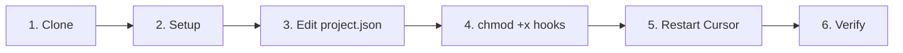

# Quick Start Guide

You can use cursor-handbook in four ways: **clone & copy** the `.cursor` folder, **add from GitHub** in Cursor Settings, **fork & customize** for your team, or **pick and choose** individual rules/agents/skills. See [Ways to use cursor-handbook](https://github.com/girijashankarj/cursor-handbook#ways-to-use-cursor-handbook) in the README for details. This guide walks through the clone-and-copy option.

## Prerequisites

- [Cursor IDE](https://cursor.sh/) installed
- Git installed
- A project to add rules to

## Setup (5 minutes) — Option 1: Clone & copy



### Step 1: Clone cursor-handbook

```bash
# Navigate to your project root
cd your-project/

# Clone cursor-handbook as .cursor directory
git clone https://github.com/girijashankarj/cursor-handbook.git .cursor
```

### Step 2: Create project.json

```bash
# Option A: One-command setup (recommended)
make init

# Option B: Interactive generator
./scripts/init-project-config.sh

# Option C: Manual copy
cp .cursor/config/project.json.template .cursor/config/project.json
```

If using the handbook repo itself, `make init` copies `project.json.handbook` to `project.json`.

### Step 3: Edit project.json

Open `.cursor/config/project.json` and replace all `{{PLACEHOLDER}}` values:

```json
{
	"project": {
		"name": "your-project-name",
		"description": "Your project description"
	},
	"techStack": {
		"language": "TypeScript",
		"framework": "Express.js",
		"database": "PostgreSQL",
		"testing": "Jest",
		"packageManager": "pnpm"
	},
	"testing": {
		"coverageMinimum": 90,
		"testCommand": "pnpm run test",
		"typeCheckCommand": "pnpm run type-check"
	}
}
```

### Step 4: Make hook scripts executable (required for hooks)

```bash
chmod +x .cursor/hooks/*.sh
```

Without this, hooks will not run.

### Step 5: Restart Cursor IDE

Close and reopen Cursor IDE to load the new configuration.

### Step 6: Verify

Try one of these commands in Cursor:

- `/type-check` — Run type checking
- `/code-reviewer` — Start a code review
- Ask Cursor to "create a new handler for orders"

## What's Included

After setup, you'll have:

- **29 rules** automatically applied to all AI interactions
- **34 agents** available via `/agent-name` commands
- **21 skills** for guided workflows
- **14 commands** for quick actions
- **12 hooks** automating the AI loop

## Other ways to use cursor-handbook

- **Add from GitHub:** Cursor IDE → Settings → Rules / Skills / Agents → Add new → Add from GitHub → paste repo URL.

  
- **Fork:** Fork the repo, customize `.cursor` for your project, then use the fork across your repos.
- **Pick and choose:** Copy only the production-ready, generic rules, agents, skills, or hooks you need from this repo into your project’s `.cursor` folder. See [Component readiness](../component-readiness.md) for the full list.

Want to add or improve components? See [CONTRIBUTING.md](../../CONTRIBUTING.md).

## Next Steps

- [Project Setup Guide](./configuration.md)
- [Component Overview](../components/overview.md)
- [Best Practices](../guides/best-practices.md)
