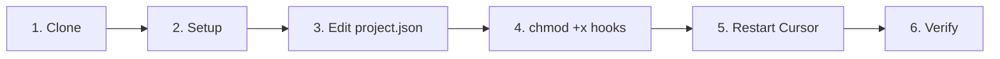

# Quick Start Guide

You can use cursor-handbook in several ways: **npm install**, **clone & copy**, **add from GitHub**, **fork & customize**, or **pick and choose** individual components. See [Ways to use cursor-handbook](https://github.com/girijashankarj/cursor-handbook#ways-to-use-cursor-handbook) in the README for details.

## Prerequisites

- [Cursor IDE](https://cursor.sh/) installed
- Node.js 16+ (for npm method) or Git (for clone method)
- A project to add rules to

## Setup (2 minutes) — Option 1: npm (Recommended)

> **npm package:** [npmjs.com/package/cursor-handbook](https://www.npmjs.com/package/cursor-handbook)

```bash
npx cursor-handbook init
```

You'll be prompted to either **copy all** components or **select by category** (frontend, backend, database, cloud, testing, devops, documentation, security — multi-select). To skip the prompt and copy everything:

```bash
npx cursor-handbook init --all
```

This copies the `.cursor/` folder, `CLAUDE.md`, `AGENTS.md`, and `SETUP-GUIDE.md` into your project root.

Then:

1. Edit `.cursor/config/project.json` — replace `{{PLACEHOLDER}}` values with your project details
2. Restart Cursor IDE
3. Use `@cursor-setup-agent` in Cursor to keep only the components you need
4. Remove the package when done: `npm uninstall cursor-handbook`

Or install first, then initialize:

```bash
npm install -D cursor-handbook
npx cursor-handbook init
# After setup:
npm uninstall cursor-handbook
```

The `.cursor/` folder stays in your project after uninstalling. Commit it to version control.

## Setup (5 minutes) — Option 2: Clone & copy



### Step 1: Clone cursor-handbook

```bash
# Navigate to your project root
cd your-project/

# Clone cursor-handbook as .cursor directory
git clone https://github.com/girijashankarj/cursor-handbook.git .cursor
```

### Step 2: Create project.json

```bash
# Option A: One-command setup (recommended)
make -f .cursor/Makefile init

# Option B: Interactive generator
./.cursor/scripts/init-project-config.sh

# Option C: Manual copy
cp .cursor/config/project.json.template .cursor/config/project.json
```

> **Note:** After cloning into `.cursor/`, the Makefile and scripts live inside `.cursor/`. Use `make -f .cursor/Makefile init` from your project root. If you cloned the full repo standalone, use `make init` from the repo root.

If using the handbook repo itself, `make init` copies `project.json.handbook` to `project.json`.

### Step 3: Edit project.json

Open `.cursor/config/project.json` and replace all `{{PLACEHOLDER}}` values:

```json
{
	"project": {
		"name": "your-project-name",
		"description": "Your project description"
	},
	"techStack": {
		"language": "TypeScript",
		"framework": "Express.js",
		"database": "PostgreSQL",
		"testing": "Jest",
		"packageManager": "pnpm"
	},
	"testing": {
		"coverageMinimum": 90,
		"testCommand": "pnpm run test",
		"typeCheckCommand": "pnpm run type-check"
	}
}
```

### Step 4: Make hook scripts executable (required for hooks)

```bash
chmod +x .cursor/hooks/*.sh
```

Without this, hooks will not run.

### Step 5: Restart Cursor IDE

Close and reopen Cursor IDE to load the new configuration.

### Step 6: Verify

Try one of these commands in Cursor:

- `/type-check` — Run type checking
- `/code-reviewer` — Start a code review
- Ask Cursor to "create a new handler for orders"

## What's Included

After setup, you'll have:

- **47 rules** (several always-on; others apply by file pattern or context)
- **62 agents** available via `/agent-name` commands
- **50 skills** for guided workflows
- **37 commands** for quick actions
- **12 hooks** automating the AI loop

## Other ways to use cursor-handbook

- **npm:** [`npx cursor-handbook init`](https://www.npmjs.com/package/cursor-handbook) — fastest one-command setup (see above).
- **Add from GitHub:** Cursor IDE → Settings → Rules / Skills / Agents → Add new → Add from GitHub → paste repo URL.

  
- **Fork:** Fork the repo, customize `.cursor` for your project, then use the fork across your repos.
- **Pick and choose:** Copy only the production-ready, generic rules, agents, skills, or hooks you need from this repo into your project’s `.cursor` folder. See [Component readiness](../component-readiness.md) for the full list.

Want to add or improve components? See [CONTRIBUTING.md](../../CONTRIBUTING.md).

## Next Steps

- [Project Setup Guide](./configuration.md)
- [Component Overview](../components/overview.md)
- [Best Practices](../guides/best-practices.md)
- [Cursor guidelines](../cursor-guidelines/README.md) — Cursor IDE concepts (rules, skills, hooks, security) and the handbook site **Guidelines** view
