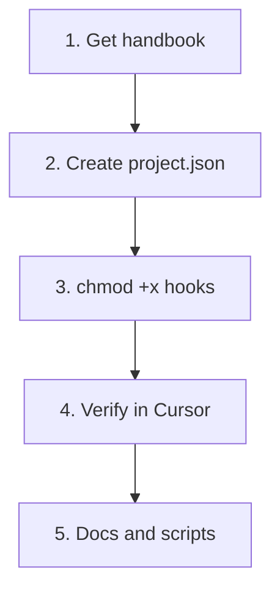

# Setup



## 1. Get the handbook

**Option A — Clone into `.cursor` (replace existing)**

```bash
cd your-project
rm -rf .cursor   # if you have an old one
git clone https://github.com/girijashankarj/cursor-handbook.git .cursor
```

**Option B — Copy from a local copy**

```bash
cp -r /path/to/cursor-handbook/.cursor your-project/.cursor
```

## 2. Create project config

```bash
cp .cursor/config/project.json.template .cursor/config/project.json
```

Edit `.cursor/config/project.json`: set project name, source paths, tech stack, database naming, and domain entities. See `docs/reference/configuration-reference.md` for all keys.

## 3. Hooks (optional)

```bash
chmod +x .cursor/hooks/*.sh
```

Edit `.cursor/hooks.json` (project root) to enable or disable hooks. Cursor expects `version: 1` and command arrays per event. See [Cursor-Recognized Files](../reference/cursor-recognized-files.md).

## 4. Verify

- Open the project in Cursor.
- Confirm rules are applied (e.g. ask the AI to create a handler and check it follows the handler pattern).
- Run type-check or a single test from the commands.

## 5. Docs and scripts

- Root-level docs: `AGENTS.md`, `CLAUDE.md`, `README.md`, `CONTRIBUTING.md`.
- Scripts in `scripts/`: `setup-cursor.sh`, `validate.sh`, etc., as needed.
