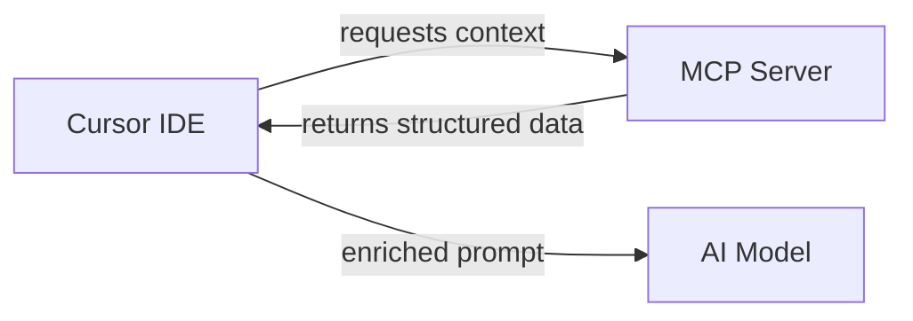

# MCP (Model Context Protocol) Guide

MCP lets external servers expose structured context to AI models. This guide covers how to use MCP with Cursor and cursor-handbook.

## What is MCP?

Model Context Protocol is an open standard that defines how servers provide context to AI clients. Instead of manually pasting documentation or API specs into your prompts, an MCP server delivers that context automatically.



## How MCP works with Cursor

Cursor acts as an MCP **client**. It connects to one or more MCP **servers** that provide:

- **Resources** — Read-only data (docs, API specs, database schemas)
- **Tools** — Actions the AI can invoke (search, query, deploy)
- **Prompts** — Pre-built prompt templates

### Configuration

MCP servers are configured in Cursor settings or in your project's `.cursor/` config:

```json
{
  "mcpServers": {
    "your-server-name": {
      "command": "npx",
      "args": ["-y", "@your-org/mcp-server"],
      "env": {
        "API_KEY": "${MCP_API_KEY}"
      }
    }
  }
}
```

**Security note:** Never hardcode API keys. Use environment variable references (`${VAR_NAME}`) in MCP config.

## Common MCP server types

| Server type | What it provides | Example use |
|-------------|-----------------|-------------|
| **Documentation** | API docs, guides, specs | "Search our API docs for pagination" |
| **Database** | Schema, sample queries | "Show me the orders table schema" |
| **Git/GitHub** | PR info, issues, commits | "Summarize the last 5 commits" |
| **Internal APIs** | Endpoint specs, status | "What endpoints does the user service expose?" |
| **Monitoring** | Metrics, logs, alerts | "Show error rate for the last hour" |

## Using MCP with cursor-handbook

MCP context is **additive** — it supplements the handbook's rules, agents, and skills. The AI receives:

1. **Handbook rules** (always applied) — coding standards, security, patterns
2. **MCP context** (on demand) — external data the AI requests when relevant
3. **Your prompt** — what you're asking

### Best practices

- **Don't duplicate rules in MCP** — If your handbook already enforces TypeScript standards, don't serve the same rules via MCP
- **Use MCP for live data** — API specs, schemas, and docs that change frequently
- **Scope MCP servers per project** — Different services may need different MCP servers
- **Audit MCP data** — Ensure MCP servers don't expose secrets, PII, or internal hostnames

### What not to put in MCP

- Secrets, credentials, or tokens
- PII or user data
- Internal infrastructure names (use placeholders)
- Entire codebases (use Cursor's built-in indexing instead)

## Setting up an MCP server

### Option 1: Use an existing server

Many MCP servers are available as npm packages:

```bash
# GitHub MCP server
npx -y @modelcontextprotocol/server-github

# Filesystem MCP server
npx -y @modelcontextprotocol/server-filesystem /path/to/docs

# Database MCP server (read-only)
npx -y @modelcontextprotocol/server-postgres $DATABASE_URL
```

### Option 2: Build a custom server

For internal APIs or proprietary data, build a custom MCP server:

```typescript
import { Server } from "@modelcontextprotocol/sdk/server/index.js";

const server = new Server({
  name: "your-service",
  version: "1.0.0",
});

server.setRequestHandler(ListResourcesRequestSchema, async () => ({
  resources: [
    {
      uri: "docs://api-spec",
      name: "API Specification",
      mimeType: "application/json",
    },
  ],
}));
```

## Troubleshooting

| Issue | Cause | Fix |
|-------|-------|-----|
| MCP server not connecting | Config path wrong or server not installed | Check `mcpServers` config, verify package exists |
| Context not appearing | Server not returning resources | Check server logs, verify resource URIs |
| Slow responses | Large context payload | Limit what the server returns, use pagination |
| Auth failures | Missing or expired credentials | Check env vars, rotate API keys |

## Reference

- [MCP specification](https://modelcontextprotocol.io)
- [Cursor MCP documentation](https://docs.cursor.com/context/model-context-protocol)
- Project-specific MCP notes: `docs/reference/mcp-integration.md`
