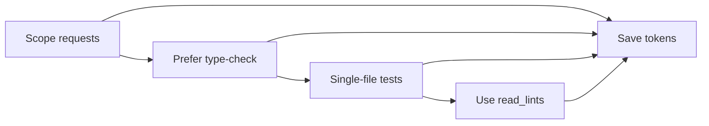

# Token efficiency

Using tokens wisely reduces cost and latency. The handbook’s rules enforce this.

## Do

- **Scope requests** — "Fix this function" or "Add a test for this file" instead of "fix the whole app."
- **Prefer type-check** — Run `npm run type-check` (or equivalent) for quick validation instead of the full test suite.
- **Single-file tests** — Run tests for the current or changed file when possible.
- **Summaries** — Ask for bullet points or a short summary instead of full file dumps.
- **Use read_lints** — In AI workflows, use the linter output instead of re-running full lint when checking for issues.

## Don’t

- **Auto-run full test suite** — Requires confirmation; use for CI, not every edit.
- **Auto-run full lint** — Use linter results or type-check by default.
- **Paste huge context** — Point to files or paste only the relevant section.
- **Repeat instructions** — Rely on rules and skills so you don’t re-specify conventions every time.

## Checking your token usage

To see how many tokens you're using:

1. Go to **[cursor.com/dashboard](https://cursor.com/dashboard)** → **Usage** tab
2. View breakdown by type (input, output, cache), remaining allowance, and on-demand charges
3. Usage resets monthly on your subscription date

See [Cursor Usage Guide](../cursor-usage.md#checking-token-usage) for details and links to limits and pricing.

## Rules reference

See `.cursor/rules/architecture/token-efficiency.mdc` and `.cursor/rules/main-rules.mdc` for the exact token-efficiency rules applied in this project.
