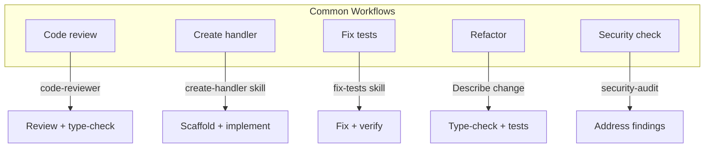

# Workflows

Example workflows that combine rules, agents, commands, and skills.

## Code review

1. Select the code (file or region).
2. Ask: "Use the code-reviewer agent" or "Review this for security and handler pattern."
3. Apply suggested changes; run type-check and a single test.

## Create a new handler

1. Say: "Create a new API handler for [entity] [operation]."
2. The create-handler skill runs; provide entity name and operation when asked.
3. Implement the generated structure; run type-check and add tests.

## Fix failing tests

1. Say: "Fix the failing tests in this file" or "Use the fix-tests skill."
2. Apply fixes; run the test file only to confirm.
3. Run type-check to avoid regressions.

## Refactor with safety

1. Describe the refactor (e.g. "Rename X to Y in this module").
2. Run type-check after the change.
3. Run tests for the affected area; then full suite in CI.

## Security check

1. Say: "Run the security audit command" or "Use the security-audit agent."
2. Address critical/high findings first.
3. Use check-secrets or scan-secrets hook before committing.
