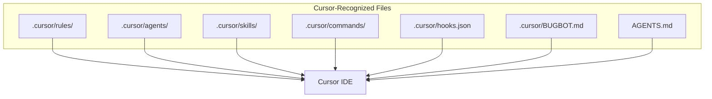

# Cursor-Recognized Files and Keywords

This document lists all files and keywords that **Cursor IDE officially recognizes** and loads. For authoritative details, see [Cursor's official documentation](https://cursor.com/docs).



---

## Files Cursor Recognizes

| File or Directory | Location | Purpose | Official Docs |
|-------------------|----------|---------|---------------|
| **Project Rules** | `.cursor/rules/` | Markdown rules with optional frontmatter | [Rules](https://cursor.com/docs/rules) |
| **AGENTS.md** | Project root or subdirectories | Simple agent instructions (no frontmatter) | [Rules → AGENTS.md](https://cursor.com/docs/rules#agentsmd) |
| **.cursorrules** | Project root | Legacy format (deprecated, still supported) | [Rules](https://cursor.com/docs/rules) |
| **Skills** | `.cursor/skills/`, `.agents/skills/`, `~/.cursor/skills/` | Step-by-step workflows; each skill = folder with `SKILL.md` | [Agent Skills](https://cursor.com/docs/skills) |
| **Hooks** | `.cursor/hooks.json` (project) or `~/.cursor/hooks.json` (user) | Scripts that run before/after agent events | [Hooks](https://cursor.com/docs/agent/hooks) |
| **BugBot rules** | `.cursor/BUGBOT.md` | PR review rules (separate from `.cursor/rules/`). **Nested:** `backend/.cursor/BUGBOT.md` applies when reviewing backend files. | [BugBot](https://cursor.com/docs/bugbot) |
| **Commands** | `.cursor/commands/` (via plugins) | Agent-executable commands; support `name`, `description` frontmatter | [Plugins Reference](https://cursor.com/docs/reference/plugins) |
| **Agents** | `.cursor/agents/` | Custom agent definitions; **must be at root** (no subdirs); support `name`, `description` frontmatter | [Plugins Reference](https://cursor.com/docs/reference/plugins) |

### Compatibility Paths (Skills)

Cursor also loads skills from Claude/Codex directories for compatibility:

- `.claude/skills/`, `~/.claude/skills/`
- `.codex/skills/`, `~/.codex/skills/`

---

## Rule File Keywords (`.mdc` / `.md` in `.cursor/rules/`)

Rules use YAML frontmatter. Cursor understands these keywords:

| Keyword | Type | Description |
|---------|------|--------------|
| `description` | string | Used by Agent to decide relevance when `alwaysApply: false`. Describe when the rule applies. |
| `alwaysApply` | boolean | `true` = apply to every chat session. `false` or omitted = Agent decides based on `description` or `globs`. |
| `globs` | string or array | File path patterns. Rule applies when matching files are in context. Use comma-separated: `src/**/*.ts,tests/**/*.ts` |

### Rule Application Modes

| Rule Type | Frontmatter | Behavior |
|-----------|-------------|----------|
| Always Apply | `alwaysApply: true` | Applied to every chat session |
| Apply Intelligently | `description` + `alwaysApply: false` | Agent decides based on description relevance |
| Apply to Specific Files | `globs: "src/**/*.ts"` | When files matching pattern are in context |
| Apply Manually | Empty or minimal | Only when `@rule-name` mentioned in chat |

### Example

```markdown
---
description: "Standards for API handlers and validation"
alwaysApply: false
globs: src/**/*.ts,src/**/*.tsx
---

- Use zod for request validation
- Export types from schemas
```

### Keywords in Use (cursor-handbook)

| Rule Type | `description` | `alwaysApply` | `globs` |
|-----------|----------------|---------------|---------|
| Global (main-rules, security, token-efficiency) | ✓ | `true` | — |
| Domain-specific (handler-patterns, api-design, database/*, frontend/*) | ✓ | `false` | ✓ |

---

## Skill File Keywords (`SKILL.md` in `.cursor/skills/<skill-name>/`)

Skills use YAML frontmatter in `SKILL.md`:

| Keyword | Required | Description |
|---------|----------|-------------|
| `name` | Yes | Skill identifier. Lowercase, numbers, hyphens only. Must match parent folder name. |
| `description` | Yes | What the skill does and when to use it. Agent uses this for relevance. |
| `license` | No | License name or reference |
| `compatibility` | No | Environment requirements (packages, network, etc.) |
| `metadata` | No | Arbitrary key-value metadata |
| `disable-model-invocation` | No | `true` = only invoked via `/skill-name`; agent won't auto-apply |

### Keywords in Use (cursor-handbook)

All skills use YAML frontmatter with required `name` and `description`. Optional keywords (`license`, `compatibility`, `metadata`, `disable-model-invocation`) are used where needed.

### Skill Directory Structure

```
.cursor/skills/
└── my-skill/
    ├── SKILL.md
    ├── scripts/        # Optional: executable scripts
    ├── references/     # Optional: additional docs
    └── assets/         # Optional: templates, data files
```

---

## Hooks Configuration (`hooks.json`)

**Location:** `.cursor/hooks.json` (project) or `~/.cursor/hooks.json` (user)

**Format:** Cursor expects `version: 1` and an array of command objects per event:

```json
{
  "version": 1,
  "hooks": {
    "beforeSubmitPrompt": [{ "command": ".cursor/hooks/context-enrichment.sh" }],
    "afterFileEdit": [{ "command": ".cursor/hooks/auto-format.sh" }],
    "beforeShellExecution": [{ "command": ".cursor/hooks/shell-guard.sh" }]
  }
}
```

### Hook Event Names (Agent)

- `sessionStart` / `sessionEnd`
- `beforeSubmitPrompt` / `afterAgentResponse` / `afterAgentThought`
- `beforeReadFile` / `afterFileEdit`
- `beforeShellExecution` / `afterShellExecution`
- `beforeMCPExecution` / `afterMCPExecution`
- `subagentStart` / `subagentStop`
- `preToolUse` / `postToolUse` / `postToolUseFailure`
- `preCompact` / `stop`

### Hook Command Options

| Option | Type | Description |
|--------|------|--------------|
| `command` | string | Required for command-based. Path to script (from project root for project hooks) |
| `timeout` | number | Optional. Execution timeout in seconds |
| `matcher` | string | Optional. Regex to match (e.g. for `beforeShellExecution`) |
| `type` | string | `"prompt"` for LLM-evaluated hooks (no script) |
| `prompt` | string | Natural language condition when `type: "prompt"` |

### Prompt-Based Hooks

Use an LLM to evaluate conditions without custom scripts:

```json
{
  "beforeShellExecution": [
    {
      "type": "prompt",
      "prompt": "Does this command look safe? Only allow read-only operations.",
      "timeout": 10
    }
  ]
}
```

### Tab Hooks (Inline Completions)

Separate from Agent hooks: `beforeTabFileRead`, `afterTabFileEdit`.

### Exit Codes

- `0` — Success; use JSON output
- `2` — Block the action
- Other — Hook failed; action proceeds (fail-open)

---

## AGENTS.md

Plain markdown, no frontmatter. Cursor supports:

- **Root:** `AGENTS.md` in project root
- **Nested:** `AGENTS.md` in subdirectories (e.g. `frontend/AGENTS.md`)

Nested files combine with parent instructions; more specific paths take precedence.

---

## Commands and Agents Frontmatter

Per [Plugins Reference](https://cursor.com/docs/reference/plugins), commands and agents support YAML frontmatter for discovery:

```markdown
---
name: my-command
description: Brief description of what this does
---

# Command content...
```

---

## Remote Rules

Import rules from GitHub: Cursor Settings → Rules → Add Rule → Remote Rule (Github). Paste repo URL; rules stay synced with the source.

---

## Official Cursor Documentation URLs

| Topic | URL |
|-------|-----|
| Full features index | [cursor-official-features.md](cursor-official-features.md) |
| Rules | https://cursor.com/docs/rules |
| Agent Skills | https://cursor.com/docs/skills |
| Hooks | https://cursor.com/docs/agent/hooks |
| BugBot | https://cursor.com/docs/bugbot |
| Plugins Reference | https://cursor.com/docs/reference/plugins |
| Agent Overview | https://cursor.com/docs/agent/overview |
| Usage & Limits | https://cursor.com/help/models-and-usage/usage-limits |
| Token Pricing | https://cursor.com/help/models-and-usage/token-fee |
| Dashboard | https://cursor.com/dashboard |

---

## cursor-handbook Extensions (Not Cursor Native)

The following are **cursor-handbook conventions**, not part of Cursor's official spec:

| Item | Purpose |
|------|---------|
| `project.json` | Central configuration; rules reference it via `{{CONFIG}}` placeholders. See [project.json and Centralization](../getting-started/configuration.md#projectjson-and-centralization). |
| `CLAUDE.md` | Claude Code compatibility; Cursor also respects `AGENTS.md`. |
| Subdirectory organization | `.cursor/rules/` supports subfolders; Cursor loads recursively. **Agents must be at root** — Cursor does not discover agents in subdirectories. |
