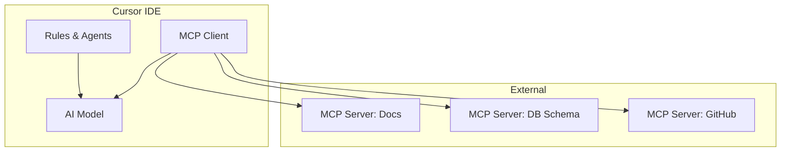

# MCP Integration Reference

How cursor-handbook integrates with Model Context Protocol (MCP) servers.

## Architecture



## Configuration locations

| Config | Location | Purpose |
|--------|----------|---------|
| Global MCP | `~/.cursor/mcp.json` | MCP servers available in all projects |
| Project MCP | `.cursor/mcp.json` | MCP servers specific to this project |
| Handbook rules | `.cursor/rules/*.mdc` | Static rules applied to all prompts |

## Setting up project MCP

Create `.cursor/mcp.json` in your project root:

```json
{
  "mcpServers": {
    "project-docs": {
      "command": "npx",
      "args": ["-y", "@modelcontextprotocol/server-filesystem", "./docs"],
      "env": {}
    },
    "github": {
      "command": "npx",
      "args": ["-y", "@modelcontextprotocol/server-github"],
      "env": {
        "GITHUB_PERSONAL_ACCESS_TOKEN": "${GITHUB_TOKEN}"
      }
    }
  }
}
```

**Security rules:**
- Never hardcode tokens — use `${ENV_VAR}` references
- Add `mcp.json` to `.gitignore` if it contains org-specific server URLs
- Or commit it with placeholder values and document required env vars

## Handbook + MCP interaction

### What the handbook provides (static)
- Coding standards (always applied via rules)
- Agent behaviors (structured workflows)
- Skills (step-by-step procedures)
- Security guardrails (always enforced)

### What MCP provides (dynamic)
- Live API documentation
- Database schemas that change with migrations
- GitHub PR context and issue details
- Monitoring data (logs, metrics)
- Internal knowledge base content

### Overlap prevention

If both handbook rules and MCP context cover the same topic, the handbook rule takes precedence. To avoid confusion:

1. Don't serve coding standards via MCP — use `.cursor/rules/` instead
2. Don't serve static project info via MCP — use `project.json` instead
3. Use MCP for data that changes frequently or lives outside the repo

## Recommended MCP servers by role

### Backend developers
| Server | What it provides |
|--------|-----------------|
| Filesystem (docs/) | API specs, architecture docs |
| PostgreSQL/MySQL | Table schemas, sample queries |
| GitHub | PR context, issue details |

### Frontend developers
| Server | What it provides |
|--------|-----------------|
| Filesystem (docs/) | Component docs, design system |
| Storybook | Component examples |
| GitHub | PR context, issue details |

### DevOps
| Server | What it provides |
|--------|-----------------|
| GitHub | Workflow files, deployment status |
| Cloud provider | Resource inventory, metrics |
| Filesystem (infra/) | Terraform/CDK documentation |

## Token considerations

MCP context counts toward the model's context window. To minimize token usage:

- Configure MCP servers to return summaries, not full documents
- Use resource URIs to fetch specific items on demand
- Set size limits on MCP responses where supported
- Prefer handbook rules for static context (they're already optimized)

## Validation checklist

Before deploying MCP to your team:

- [ ] MCP servers don't expose secrets or credentials
- [ ] MCP servers don't return PII
- [ ] Infrastructure names are masked (use placeholders)
- [ ] Token cost is acceptable (test with a sample session)
- [ ] MCP context doesn't contradict handbook rules
- [ ] Required env vars are documented in `.env.example`

## Reference

- Overview: `docs/guides/ai-adoption/mcp-guide.md`
- MCP specification: [modelcontextprotocol.io](https://modelcontextprotocol.io)
- Cursor MCP docs: [docs.cursor.com/context/model-context-protocol](https://docs.cursor.com/context/model-context-protocol)
