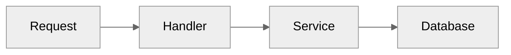
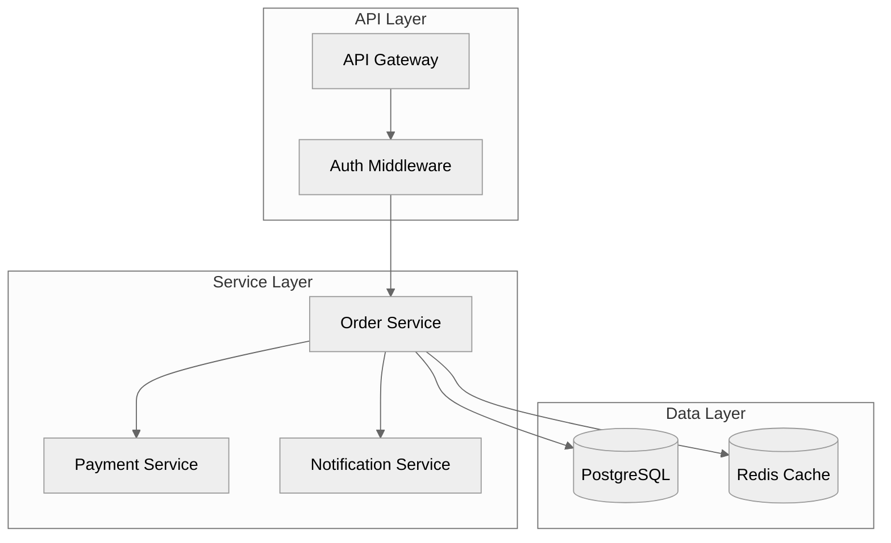
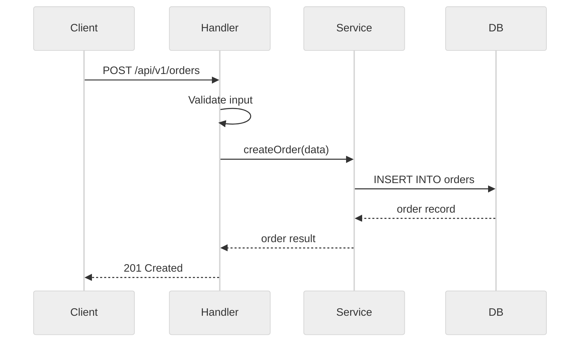
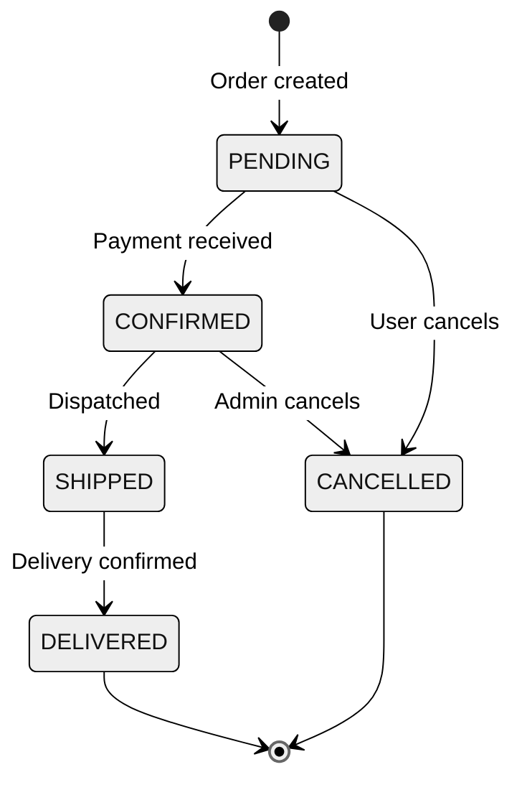
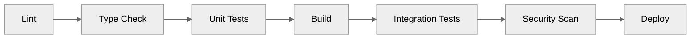

# Mermaid Theme Reference

Standardize Mermaid diagrams across your docs and AI-generated architecture notes.

## Recommended theme

Use the `neutral` theme for clean, professional diagrams that work in both light and dark modes:



## Available themes

| Theme | Best for | Look |
|-------|----------|------|
| `default` | General use | Blue/purple palette |
| `neutral` | Documentation, PRs | Grayscale, professional |
| `dark` | Dark-mode docs/IDEs | Dark background |
| `forest` | Presentations | Green palette |

## Common diagram types

### Architecture / data flow



### Sequence diagram (request flow)



### State diagram (entity lifecycle)



### CI/CD pipeline



## Configuration

### In MkDocs (`mkdocs.yml`)

```yaml
markdown_extensions:
  - pymdownx.superfences:
      custom_fences:
        - name: mermaid
          class: mermaid
          format: !!python/name:pymdownx.superfences.fence_code_format

extra_javascript:
  - https://cdn.jsdelivr.net/npm/mermaid/dist/mermaid.min.js

extra:
  mermaid:
    theme: neutral
```

### In Docusaurus

```javascript
module.exports = {
  markdown: {
    mermaid: true,
  },
  themes: ['@docusaurus/theme-mermaid'],
  themeConfig: {
    mermaid: {
      theme: { light: 'neutral', dark: 'dark' },
    },
  },
};
```

### Inline (per diagram)

Add a theme directive at the top of any diagram:

```
%%{init: {'theme': 'neutral'}}%%
```

## Conventions for cursor-handbook

- Use `neutral` theme by default for all docs
- Use `flowchart` for architecture and data flow
- Use `sequenceDiagram` for request/response flows
- Use `stateDiagram-v2` for entity lifecycles
- Use `flowchart LR` (left-to-right) for pipelines and processes
- Keep diagrams under 15 nodes for readability
- Use subgraphs to group related components
