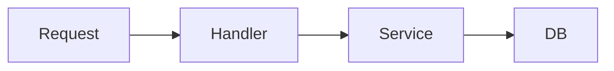

# Mermaid theme

If you use Mermaid diagrams in docs or in AI-generated architecture notes, you can standardize their look with a theme.

## Example (default)

## Theme configuration

- For MkDocs or other static site generators, set the Mermaid theme in the docs config (e.g. `mkdocs.yml`).
- Common themes: `default`, `neutral`, `dark`, `forest`. Prefer one that matches your docs style.

This file is a placeholder; add your project’s chosen theme and snippet here.
